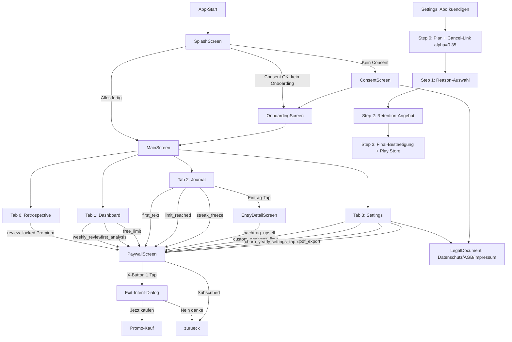

# App-Roentgen Audit-Bericht — BestJournalAndroid

**Audit-Datum:** 2026-05-01
**App-Version:** v0.18.3 / Build 217 (Stand: 2026-04-30 Session)
**Geprueftes Verzeichnis:** `~/proggs/BestJournalAndroid/`
**Audit durch:** `app-roentgen` Skill (Claude Code, 4 parallele Subagenten + Initial-Scan)
**Methodik:** 7-Schichten-Tiefenanalyse nach UWG §5/§5a, EU UCPD, Google Play Subscription Policy

---

## Inhaltsverzeichnis

1. [Zusammenfassung fuer Frank](#1-zusammenfassung-fuer-frank)
2. [Schicht 1 — Manifest-Analyse](#2-schicht-1--manifest-analyse)
3. [Schicht 2 — Dependency-Analyse](#3-schicht-2--dependency-analyse)
4. [Schicht 3 — Architektur-Inventar](#4-schicht-3--architektur-inventar)
5. [Schicht 4 — Bildschirm-Karte und Klick-Pfade](#5-schicht-4--bildschirm-karte-und-klick-pfade)
6. [Schicht 5 — Paywall-Tiefenanalyse](#6-schicht-5--paywall-tiefenanalyse) **(WICHTIGSTER ABSCHNITT)**
7. [Schicht 6 — Hidden Features](#7-schicht-6--hidden-features)
8. [Schicht 7 — Werbeaussage-vs-Feature-Matrix](#8-schicht-7--werbeaussage-vs-feature-matrix)
9. [Don't-Miss-Checkliste (50 Punkte)](#9-dont-miss-checkliste)
10. [Empfohlene naechste Schritte](#10-empfohlene-naechste-schritte)

---

## 1. Zusammenfassung fuer Frank

Die App `BestJournalAndroid` ist technisch sauber gebaut: 138 Kotlin-Dateien, 10 Bildschirme, 9 ViewModels, 10 UseCases, 7 Repositories, alles Compose mit Hilt-DI und Room-Datenbank. Der Audit hat **fuenf kritische Werbeaussagen-Probleme** gefunden, die du vor dem naechsten Release fixen solltest — alle haengen damit zusammen, dass die App "unbegrenzt" verspricht, aber im Code ein hartes Tageslimit von 150 KI-Aufrufen drin ist. Dazu ein Dark-Pattern-Befund im Kuendigungs-Flow (durchsichtiger Cancel-Link mit Alpha 0.35) und eine fehlende Web-URL fuer Account-Loeschung, die Google Play seit 2024 verlangt. Die gute Nachricht: Die Widerrufsbelehrung, der "zahlungspflichtig abonnieren"-Button und die Cloud-Function-Subscription-Validierung sind musterhaft umgesetzt.

**Audit-Statistik:**

| Bereich | Wert |
|---------|------|
| Kotlin-Dateien | 138 |
| Bildschirme (Top-Level Screens) | 10 |
| ViewModels | 9 |
| UseCases | 10 |
| Repositories | 7 |
| Room-Entities | 5 |
| Hilt-Module | 5 |
| Permissions | 7 |
| BroadcastReceiver | 5 (Daily, Weekly, Monthly, Yearly, BootReminder) |
| Notification-Channels | 4 |
| Workers (WorkManager) | 0 (nutzt AlarmManager) |
| Paywall-Bildschirme | 1 + Exit-Intent-Dialog + 4-Step-Churn-Flow |
| Subscription-States im Code | 2 von 7 (Free, Subscribed — andere ueber Cloud-Sync abgebildet) |
| Strings (Hauptsprache) | 1062 |
| Uebersetzte Sprachen | 27 |
| **Werbeaussagen-Befunde gesamt** | **15** |
| Davon **KRITISCH** | **4** |
| Davon **HOCH** | **4** |
| Davon MITTEL | **5** |
| Davon NIEDRIG | **2** |

**Top-5 kritischste Befunde (sofort fixen):**

| # | Befund | Risiko | Norm |
|---|--------|--------|------|
| 1 | "Unbegrenzte KI" bei faktischem Tages-Hard-Limit 150 Aufrufe (7 Strings × 27 Sprachen) | KRITISCH | UWG §5, EU UCPD Art. 6 |
| 2 | Cancel-Link `alpha=0.35f` in ChurnFlowDialog Step 0 (Dark Pattern) | KRITISCH | UWG §4 Nr. 4, EU UCPD Art. 8, Google Play Policy |
| 3 | Account-Deletion Web-URL fehlt (Google Play Pflicht seit 2024) | HOCH | Google Play Policy |
| 4 | "Unbegrenzte Tagebucheintraege" als Premium-Feature beworben, ist aber Free-Feature | HOCH | UWG §5 |
| 5 | Lifetime "fuer immer" ohne App-Verfuegbarkeits-Vorbehalt | HOCH | UWG §5a, BGB §327 ff. |

---

## 2. Schicht 1 — Manifest-Analyse

### 2.1 Permissions (7 deklariert)

| Permission | Im Code genutzt | Datei:Zeile | Impliziertes Feature | Status |
|-----------|----------------|-------------|---------------------|--------|
| `INTERNET` | JA | uebergreifend | Cloud-Aufrufe (Firebase, Drive, Groq) | OK |
| `ACCESS_NETWORK_STATE` | JA | NetworkModule.kt | Netzwerk-Status-Pruefung | OK |
| `RECORD_AUDIO` | JA | RecordAudioUseCase, AnimatedMicButton | Voice-Input fuer Whisper-Transkription | OK |
| `CAMERA` | JA | EntryDetailScreen, JournalScreen | Foto-Anhaenge in Eintraegen | OK |
| `ACCESS_COARSE_LOCATION` | JA | SettingsScreen.kt:591-687 | "Follow Sun" Feature (Sonnenauf-/Untergang) | **PRUEFEN** — DSGVO-Hinweis erforderlich |
| `POST_NOTIFICATIONS` | JA | BestJournalApp.kt:81 + Receiver | Tages-/Review-Erinnerungen | OK |
| `RECEIVE_BOOT_COMPLETED` | JA | BootReminderReceiver | Re-Schedule der Reminder nach Reboot | OK |

**Befund Schicht 1.1:** `ACCESS_COARSE_LOCATION` ist ungewoehnlich fuer eine Tagebuch-App. Der Code zeigt: Standort wird lokal (in EncryptedSharedPreferences) gespeichert fuer Sonnenauf-/Untergang-Berechnung. Das Feature ist legitim, MUSS aber in der Datenschutzerklaerung erwaehnt werden und in der Play Console Data Safety als "Grober Standort — App-Funktionalitaet" eingetragen sein.

### 2.2 Activities (1)

| Activity | Exported | Intent-Filter | Zweck |
|----------|----------|--------------|-------|
| `MainActivity` | true | `MAIN` + `LAUNCHER` | App-Hauptstart, Single-Activity-Architektur |

### 2.3 Services (0)

Keine Services deklariert. Push-Notifications laufen ueber AlarmManager statt FCM.

### 2.4 BroadcastReceiver (5 — alle in `util/`)

| Receiver | Exported | Triggers | Zweck |
|----------|----------|---------|-------|
| `ReminderReceiver` | false | AlarmManager-intern | Tages-Erinnerung |
| `WeeklyReviewReceiver` | false | AlarmManager-intern | Wochen-Review-Notification |
| `MonthlyReviewReceiver` | false | AlarmManager-intern | Monats-Review (ID 2003) + Self-Reschedule |
| `YearlyReviewReceiver` | false | AlarmManager-intern | Jahres-Review (ID 2004) + Self-Reschedule |
| `BootReminderReceiver` | **true** | `BOOT_COMPLETED`, `TIMEZONE_CHANGED`, `TIME_SET` | Re-Schedule aller Alarme |

### 2.5 ContentProvider (1)

| Provider | Authorities | Zweck |
|----------|-----------|-------|
| `FileProvider` | `${applicationId}.fileprovider` | Foto-Sharing aus App heraus |

### 2.6 Deep-Links (keine)

Keine Custom-URL-Schemes oder https-Deep-Links deklariert. Das ist konservativ und reduziert die Angriffsflaeche.

### 2.7 Backup-Konfiguration

```xml
android:allowBackup="true"
android:fullBackupContent="@xml/backup_rules"
android:dataExtractionRules="@xml/data_extraction_rules"
```

| Datenbank/Datei | Backup? |
|----------------|---------|
| `entropy_journal_db` (Tagebucheintraege, Fotos, Follow-Ups, **moodTag**) | **JA — inklusive** |
| `dashboard_db` | Ausgeschlossen |
| `retrospective_db` | Ausgeschlossen |
| `entropy_journal_secure_prefs.xml` (EncryptedSharedPreferences) | Ausgeschlossen (korrekt) |

**Befund Schicht 1.7:** `moodTag` ist Art. 9 DSGVO-relevant (psychischer Gesundheitszustand) und wird via Android Auto Backup zur Google Cloud uebertragen — das muss in der Datenschutzerklaerung explizit erwaehnt werden.

### 2.8 Audit-Befunde Schicht 1

| # | Befund | Risiko | Datei | Empfehlung |
|---|--------|--------|-------|-----------|
| 1.A | `ACCESS_COARSE_LOCATION` muss in Data Safety + DS-Erklaerung erwaehnt sein | MITTEL | AndroidManifest.xml | Eintrag in Play Console + DS-Erklaerung pruefen |
| 1.B | `moodTag` (Art. 9 DSGVO) im Auto-Backup ohne Feldverschluesselung | MITTEL | backup_rules.xml | In DS-Erklaerung explizit nennen, Feldverschluesselung erwaegen |

---

## 3. Schicht 2 — Dependency-Analyse

### 3.1 Build-System

- **AGP** 8.7.3
- **Kotlin** 2.1.0
- **KSP** 2.1.0-1.0.29
- **Compose BOM** 2025.01.01
- **Min SDK / Target SDK:** nicht aus Initial-Scan extrahiert — bitte manuell pruefen

### 3.2 Aktive Plugins

- `com.android.application` (AGP)
- `org.jetbrains.kotlin.android`
- `org.jetbrains.kotlin.plugin.compose`
- `com.google.devtools.ksp`
- `com.google.dagger.hilt.android`
- `com.google.gms.google-services` (Firebase)

### 3.3 Capability-Cluster

#### Firebase
- `firebase-bom` 34.11.0 (Versionscontainer)
- `firebase-ai` (Gemini-Integration ueber Firebase)
- `firebase-appcheck-playintegrity` + `firebase-appcheck-debug`
- `firebase-config` (Remote Config — 1 Key in Verwendung: `groq_api_key`)
- `firebase-analytics` (Tracking — 8 Code-Treffer, AnalyticsTracker.kt)
- `firebase-functions` (europe-west1, fuer Subscription-Validation und Promo-Pricing)
- **NICHT enthalten:** firebase-crashlytics, firebase-messaging (FCM Push), firebase-auth, firebase-firestore

#### Persistenz
- **Room** 2.7.0 — 5 Entities, 3 Datenbanken (`AppDatabase`, `RetrospectiveDatabase`, `DashboardDatabase`)
- `androidx.security:security-crypto` 1.1.0-alpha06 — EncryptedSharedPreferences (AES256_SIV/GCM)

#### KI / ML
- **Firebase AI** (Gemini ueber Firebase, mit AppCheck-Schutz)
- **Groq API** (Whisper-Transkription via Retrofit, API-Key aus Remote Config)
- **NICHT enthalten:** OpenAI direkt, ML Kit, on-device-Whisper

#### Authentifizierung
- `androidx.credentials` 1.5.0-alpha06 (Passkey-Support)
- `googleid` 1.1.1 (Google Sign-In)
- `androidx.biometric` 1.2.0-alpha05 (Fingerabdruck/Face-Unlock)

#### Cloud-Backup
- `google-api-client-android` 2.7.0
- `google-api-services-drive` v3-rev20241206-2.0.0 (Google Drive appDataFolder)

#### UI
- Compose Material 3 + Material Icons Extended
- Navigation Compose 2.8.7
- **Coil 3** 3.0.4 (Bilder + Video)
- **Lottie** 6.6.4 (Animationen)
- Google Fonts in Compose

#### Billing
- **Google Play Billing** 7.1.1
- **Google Play Review** 2.0.2 (In-App-Review)

### 3.4 Tote/Verdaechtige Dependencies

Keine eindeutig toten Dependencies erkannt — alle Bibliotheken werden im Code referenziert.

### 3.5 Audit-Befunde Schicht 2

| # | Befund | Risiko | Empfehlung |
|---|--------|--------|-----------|
| 2.A | Keine Crashlytics-Integration trotz Firebase-Setup | NIEDRIG | Crashlytics fuer Production-Fehlerueberwachung erwaegen |
| 2.B | Mehrere `alpha`-Versionen (credentials, biometric, security-crypto) | NIEDRIG | Vor Release auf stabile Versionen pruefen |

---

## 4. Schicht 3 — Architektur-Inventar

### 4.1 ViewModels (9 gefunden)

| ViewModel | Datei | StateFlow(s) | Schluessel-Dependencies |
|-----------|-------|--------------|------------------------|
| `SplashViewModel` | ui/screens/splash/ | `SplashDestination` | SharedPreferences |
| `ConsentViewModel` | ui/screens/consent/ | n/a | SharedPreferences |
| `OnboardingViewModel` | ui/screens/onboarding/OnboardingViewModel.kt | `selectedGoals: List<String>` | SharedPreferences |
| `DashboardViewModel` | ui/screens/dashboard/DashboardViewModel.kt:56 | `DashboardUiState`, `adviceBlocks`, `weeklyDashboardUsed`, `isFreemiumUser` | GenerateAdviceUseCase, AnalyzeEntropyUseCase, BillingManager, AiUsageTracker, AiRateLimiter |
| `JournalViewModel` | ui/screens/journal/JournalViewModel.kt:96 | `JournalUiState`, `amplitude`, `durationSeconds` | RecordAudioUseCase, TranscribeAudioUseCase, ImproveTextUseCase, SaveJournalEntryUseCase, SummarizeEntryUseCase, AnalyzeEntropyUseCase, SyncWithDriveUseCase |
| `EntryDetailViewModel` | ui/screens/entrydetail/EntryDetailViewModel.kt:81 | `EntryDetailUiState`, `followUpAmplitude`, `followUpDurationSeconds` | SyncWithDriveUseCase, AnalyzeEntropyUseCase, ImproveTextUseCase, RecordAudioUseCase, TranscribeAudioUseCase, SummarizeEntryUseCase |
| `RetrospectiveViewModel` | ui/screens/retrospective/RetrospectiveViewModel.kt:24 | Retro-State, `subscriptionState` | GenerateRetrospectiveUseCase, BillingManager, EntryPhotoDao, RetrospectiveRepository |
| `SettingsViewModel` | ui/screens/settings/SettingsViewModel.kt:102 | `SettingsUiState` (40+ Felder), `promoInfoState: PromoInfo?` | SignInWithGoogleUseCase, SyncWithDriveUseCase, BillingManager, DailyReminderManager, RecordAudioUseCase, TranscribeAudioUseCase, ImproveTextUseCase, DriveBackupManager |
| `PaywallViewModel` | ui/screens/paywall/PaywallViewModel.kt:24 | `monthlyPrice`, `yearlyPrice`, `lifetimePrice`, `personalizedHeadline`, `subscriptionState` | BillingManager, AnalyticsTracker, SharedPreferences |

### 4.2 UseCases (10 gefunden, alle in `domain/usecase/`)

| UseCase | Aufgerufen von | Funktion |
|---------|---------------|----------|
| `GenerateAdviceUseCase` | DashboardViewModel | Empfehlungen aus Eintraegen generieren |
| `AnalyzeEntropyUseCase` | DashboardViewModel, JournalViewModel, EntryDetailViewModel | Entropie-Analyse |
| `SaveJournalEntryUseCase` | JournalViewModel | Eintrag speichern (Room + Drive-Sync) |
| `RecordAudioUseCase` | JournalViewModel, EntryDetailViewModel, SettingsViewModel | Audio aufnehmen |
| `TranscribeAudioUseCase` | JournalViewModel, EntryDetailViewModel, SettingsViewModel | Whisper-Transkription via Groq |
| `ImproveTextUseCase` | JournalViewModel, EntryDetailViewModel, SettingsViewModel | KI-Textverbesserung via Gemini |
| `SummarizeEntryUseCase` | JournalViewModel, EntryDetailViewModel | KI-Zusammenfassung |
| `SyncWithDriveUseCase` | JournalViewModel, EntryDetailViewModel, SettingsViewModel | Drive-Backup, Foto-Download, Custom-Prompt-Sync |
| `SignInWithGoogleUseCase` | SettingsViewModel | Google-Anmeldung |
| `GenerateRetrospectiveUseCase` | RetrospectiveViewModel | Wochen-/Monats-/Jahresrueckblick |

### 4.3 Repositories (7)

`AdviceRepository`, `AuthRepository`, `EntryFollowUpRepository`, `JournalRepository`, `PhotoRepository`, `RetrospectiveRepository`, `TranscriptionRepository`

### 4.4 Hilt-Module (5)

| Modul | Bereitgestellt |
|-------|---------------|
| `AppModule` | EncryptedSharedPreferences (AES256), DailyReminderManager |
| `AuthModule` | CredentialManager (Google Sign-In) |
| `DatabaseModule` | AppDatabase, RetrospectiveDatabase, DashboardDatabase + 5 DAOs |
| `FirebaseModule` | FirebaseAnalytics, FirebaseAiService, AiUsageTracker, AiRateLimiter, FirebaseFunctions (europe-west1!), SubscriptionStatusService, BillingManager |
| `NetworkModule` | OkHttpClient (Logging BODY/DEBUG, NONE/RELEASE), Retrofit (Groq), GroqApi |

**Befund Schicht 3.4:** `FirebaseFunctions` ist explizit auf `europe-west1` (Belgien) konfiguriert — DSGVO-konform.

### 4.5 Room-Datenmodell

| Entity | Tabelle | DSGVO-Sensibel |
|--------|--------|---------------|
| `AdviceBlockEntity` | advice_blocks | Indirekt (abgeleitet aus Eintraegen) |
| `EntryFollowUpEntity` | entry_followups | JA (Tagebucheintraege) |
| `EntryPhotoEntity` | entry_photos | JA (persoenliche Fotos) |
| `JournalEntryEntity` | journal_entries | **JA Art. 9 DSGVO** (`moodTag` = psych. Gesundheit) |
| `RetrospectiveSummaryEntity` | retrospective_summaries | JA |

### 4.6 Workers / Background

**Keine WorkManager-Worker.** Hintergrund-Aufgaben laufen ueber AlarmManager + BroadcastReceiver — siehe Schicht 6.

### 4.7 Sealed-State-Klassen

| Klasse | Datei:Zeile | Varianten |
|--------|-------------|-----------|
| `SubscriptionState` | billing/SubscriptionState.kt:3 | `Free`, `Subscribed` |
| `SubscriptionType` (Enum) | billing/SubscriptionState.kt:8 | `NONE`, `MONTHLY`, `YEARLY`, `LIFETIME` |
| `SplashDestination` | ui/screens/splash/SplashDestination.kt | `Consent`, `Onboarding`, `Main` |
| `PromptRecState` (Enum) | SettingsViewModel.kt | `IDLE`, `RECORDING`, `TRANSCRIBING`, `IMPROVING` |

**Befund Schicht 3.7:** Es gibt nur ZWEI Subscription-States im Code (`Free`, `Subscribed`). Lifetime wird ueber `SubscriptionType.LIFETIME` modelliert, nicht als eigener State. Andere Google-Play-States (IN_GRACE_PERIOD, ON_HOLD, PAUSED) werden nicht eigenstaendig modelliert — siehe Schicht 5.

---

## 5. Schicht 4 — Bildschirm-Karte und Klick-Pfade

### 5.1 Mermaid-Gesamtdiagramm



### 5.2 Bildschirm-Inventar (10 Screens)

#### 5.2.1 SplashScreen
- **Datei:** ui/screens/splash/SplashScreen.kt
- **Route:** `splash` (AppNavGraph.kt:60)
- **VM:** SplashViewModel
- **Zweck:** Routing-Entscheidung — Consent? Onboarding? Hauptbildschirm?
- **Aktionen:** Auto-Navigation (LaunchedEffect)
- **BackHandler:** keiner
- **Klick-Anzahl bis Hauptfunktion:** 0 (automatisch)

#### 5.2.2 ConsentScreen
- **Datei:** ui/screens/consent/ConsentScreen.kt:95
- **Route:** `consent` (AppNavGraph.kt:75)
- **Zweck:** DSGVO-Zustimmung mit Links zu Datenschutz/Nutzungsbedingungen/Impressum
- **Aktionen:** Zustimmung-Checkbox + CTA, Links zu LegalDocument
- **Klick-Anzahl:** 1 (Zustimmungs-CTA)

#### 5.2.3 OnboardingScreen
- **Datei:** ui/screens/onboarding/OnboardingScreen.kt
- **Route:** `onboarding` (AppNavGraph.kt:132)
- **VM:** OnboardingViewModel — `toggleGoal()`, `saveGoals()`, `completeOnboarding()`
- **Zweck:** Ziel-Auswahl (Stress / Klarheit / Wachstum / Gedanken ordnen) → speichert in `PREF_ONBOARDING_GOALS`
- **Wichtig:** Wird von PaywallViewModel fuer **personalisierte Headline** gelesen
- **Klick-Anzahl:** 1-2 (Ziel + Weiter)

#### 5.2.4 DashboardScreen (Tab 1)
- **Datei:** ui/screens/dashboard/DashboardScreen.kt:122 (Hauptkomponente)
- **Route:** `main`, Seite 1 (AppNavGraph.kt:207)
- **VM:** DashboardViewModel
- **Paywall-Trigger:**
  - `weekly_review` (DashboardScreen.kt:332)
  - `first_analysis` (DashboardScreen.kt:647)
  - `free_limit` (DashboardScreen.kt:689)
- **Free-Limit:** 5 Dashboard-Analysen pro Woche je Analyse-Profil (seit 0.21.8: eingebaute Profile und jede individuelle Analyse haben einen eigenen 5er-Bucket)
- **Klick-Anzahl fuer Analyse (Premium):** 1 → laeuft durch
- **Klick-Anzahl fuer Analyse (Free, Limit erreicht):** 1 → Paywall

#### 5.2.5 JournalScreen (Tab 2)
- **Datei:** ui/screens/journal/JournalScreen.kt
- **Route:** `main`, Seite 2 (AppNavGraph.kt:215)
- **VM:** JournalViewModel
- **Paywall-Trigger:**
  - `first_text` (JournalScreen.kt:693)
  - `limit_reached` (JournalScreen.kt:702)
  - `streak_freeze` (JournalScreen.kt:1539)
- **Kernfunktionen:** Text- oder Sprach-Eingabe → Whisper-Transkription → optional KI-Verbesserung → Speichern
- **Klick-Anzahl Sprach-Eintrag (Premium):** 3 (Mic-Start, Mic-Stop, Speichern)
- **Klick-Anzahl Text-Eintrag:** 2 (Textfeld, Speichern)

#### 5.2.6 EntryDetailScreen
- **Datei:** ui/screens/entrydetail/EntryDetailScreen.kt
- **Route:** `entry_detail/{entryId}?searchQuery={searchQuery}` (AppNavGraph.kt:262)
- **VM:** EntryDetailViewModel
- **Paywall-Trigger:**
  - `nachtrag_upsell` (EntryDetailScreen.kt:1457)
- **Kernfunktionen:** Eintrag anzeigen/bearbeiten, Foto, KI-Verbesserung, Nachtraege (Follow-Ups), KI-Zusammenfassung
- **Free-Limit:** 1 Nachtrag pro Eintrag (EntryDetailViewModel.kt:325-327)
- **Klick-Anzahl fuer Nachtrag (Free, 2.+):** 1 → Paywall

#### 5.2.7 RetrospectiveScreen (Tab 0)
- **Datei:** ui/screens/retrospective/RetrospectiveScreen.kt
- **Route:** `main`, Seite 0 (AppNavGraph.kt:197)
- **VM:** RetrospectiveViewModel
- **Paywall-Trigger:**
  - `review_locked` (RetrospectiveScreen.kt:243)
- **Free-Limit:** 2 aktuellste Wochenrueckblicke. Monats-/Jahresrueckblicke: gesperrt
- **Klick-Anzahl fuer Rueckblick (Free, 3.+):** 1 → Paywall
- **Klick-Anzahl fuer Rueckblick (Premium):** 1

#### 5.2.8 SettingsScreen (Tab 3)
- **Datei:** ui/screens/settings/SettingsScreen.kt (~3900 Zeilen — sehr umfangreich)
- **Route:** `main`, Seite 3 (AppNavGraph.kt:232)
- **VM:** SettingsViewModel (~40+ Felder in `SettingsUiState`)
- **Paywall-Trigger:**
  - `custom_analyses_limit` (SettingsScreen.kt:2506)
  - `churn_yearly_switch` (SettingsScreen.kt:2726)
  - `settings_tap` (2× — :2881, :4027)
  - `pdf_export` (SettingsScreen.kt:3033)
- **Account-Loeschung:** SettingsScreen.kt:3782 (`viewModel.deleteAccount(context)`)
- **Wichtige Sub-Bereiche:** Profil, Backup-Drive, Privacy/Consent, Reminder-Einstellungen, KI-Einstellungen, Custom Analysis (max 2 Free), Churn-Flow, Datenexport (PDF), Konto-Loeschung
- **Klick-Anzahl PDF-Export (Premium):** 1
- **Klick-Anzahl PDF-Export (Free):** 1 → Paywall

#### 5.2.9 PaywallScreen
- **Datei:** ui/screens/paywall/PaywallScreen.kt (~938 Zeilen)
- **Route:** `paywall?source={source}` (AppNavGraph.kt:286)
- **Default source:** `"limit_reached"`
- **VM:** PaywallViewModel
- **Auto-Dismiss:** `LaunchedEffect(subscriptionState)` → dismisst sofort wenn Subscribed (Loop-7 Fix 2026-04-30)
- **Kauf-CTAs:**
  1. Primaerer "Weiter"-Button → Jahres-Abo (mit Trial)
  2. "Beliebteste Wahl" OutlinedButton → identisch Jahres-Abo
  3. OutlinedButton → Monats-Abo
  4. Lifetime-Surface (Amber-Rahmen) → Lifetime-Kauf
- **X-Button:** ruft NICHT direkt onDismiss auf, sondern oeffnet Exit-Intent-Dialog mit Promo (50% Rabatt + Bonus-Tage)
- **Exit-Intent-Dialog:**
  - "Jetzt kaufen" → `launchPurchaseFlow(isYearly=false, usePromoOffer=true)`
  - "Nein danke" → onDismiss

**Klick-Anzahl Paywall-Exit ohne Kauf: 2 Taps** (X → "Nein danke") — siehe Befund 4.A

#### 5.2.10 LegalDocumentScreen
- **Datei:** ui/screens/consent/LegalDocumentScreen.kt:182
- **Routen:** `legal/datenschutz`, `legal/nutzungsbedingungen`, `legal/impressum` (AppNavGraph.kt:99-129)
- **VM:** keiner
- **Zweck:** Anzeige der drei Pflicht-Rechtstexte
- **Klick-Anzahl:** Back-Button

### 5.3 Externe Entry-Points

| Trigger | Ziel | Was passiert |
|---------|------|-------------|
| App-Icon-Tap | MainActivity → SplashScreen | Standard-Start |
| Notification-Tap (Daily-Reminder) | MainActivity mit `open_tab=2` | Sprung in Journal-Tab |
| Notification-Tap (Monthly-Review) | MainActivity mit `open_tab=0` | Sprung in Retrospective-Tab |
| BOOT_COMPLETED | BootReminderReceiver → Reschedule Alarme | Hintergrund (kein UI) |

**KEINE Deep-Links via http/https oder Custom-Scheme**, KEIN Share-Receiver.

### 5.4 Click-Counter pro Werbeaussage (1-Klick-Verifikation)

| Werbeaussage | Versprochen | Tatsaechlich | Befund |
|------------|------------|-------------|--------|
| "KI-Analyse mit 1 Tap" | 1 | 1 (Premium) / 1 → Paywall (Free Limit) | OK |
| "Tagebuch in Sekunden" | wenige | 2-3 Taps | OK (Hyperbel) |
| "PDF-Export" | 1 | 1 (Premium) / 1 → Paywall (Free) | OK |
| "Rueckblick jederzeit" | 1 | 1 (Premium) | OK |
| "Paywall schliessen" | 1 (X-Button) | **2 Taps** (X → Nein danke) | **BEFUND 4.A** |
| "Nachtraege" | 1 | 1 (Premium) | OK |

### 5.5 Audit-Befunde Schicht 4

| # | Befund | Risiko | Datei | Empfehlung |
|---|--------|--------|-------|-----------|
| 4.A | Paywall-Exit braucht 2 Pflicht-Taps (X → Exit-Intent-Dialog → "Nein danke") | MITTEL | PaywallScreen.kt | Ueberdenken: Exit-Intent ist legitime Marketing-Praxis, aber 2 Taps statt 1 ist Grenze zum Dark Pattern. Empfehlung: Exit-Intent nur einmal pro Session zeigen, danach direkter Exit |
| 4.B | Paywall-Source-Strings (9 verschiedene Werte als Strings, kein Enum) | NIEDRIG | AppNavGraph.kt | Sealed Class fuer Source-Werte — verhindert Tippfehler bei Analytics |

---

## 6. Schicht 5 — Paywall-Tiefenanalyse

> **WICHTIGSTER ABSCHNITT — bekommt eigenes Inhaltsverzeichnis und Detail-Auswertung**

### 6.0 Paywall-Inhaltsverzeichnis

1. Subscription-Plaene und Preisdarstellung
2. Subscription-State-Machine
3. Pflichtangaben pro Paywall-Bildschirm
4. Premium-Feature-Limits (Code-Realitaet) ← KRITISCH
5. Cancel-Flow (ChurnFlowDialog) ← KRITISCH (Dark Pattern)
6. Server-Side Validation (Cloud Function)
7. Edge-Cases
8. Audit-Befunde Schicht 5

### 6.1 Subscription-Plaene

| Plan | Product-ID | Preis-Quelle |
|------|-----------|-------------|
| Monatlich | `bestjournal_ai_monthly` | Live aus Google Play `monthlyPrice` StateFlow |
| Jaehrlich | `bestjournal_ai_yearly` | Live aus Google Play `yearlyPrice` StateFlow |
| Lifetime (INAPP) | `bestjournal_lifetime` | Live aus Google Play `lifetimePrice` StateFlow |

**Promos:**
- **Exit-Intent-Promo:** `monthly-50-off-first` Offer (50% auf 1. Monat)
- **Retention-Discount (Churn Step 2):** 25% via separate Base Plans (`retention-monthly-75`, `retention-yearly-75`) — als Base Plans (Dauerrabatt), nicht Intro-Pricing

**Befund positiv:** Alle Preise kommen live aus Google Play `ProductDetails`. Kein hardcodierter Preis im UI. Kaufbutton erst aktiv wenn `pricesLoaded = true`.

**Befund 5.A (MITTEL):** In `Constants.kt` sind Fallback-Strings hinterlegt:
```
RETENTION_MONTHLY_PRICE = "2,99 €"
RETENTION_YEARLY_PRICE = "22,49 €"
```
Diese werden in der ChurnFlowDialog als Fallback angezeigt wenn Cloud-Preis nicht verfuegbar. UWG §5 Abs. 1 Nr. 2 (irrefuehrende Preisangaben) — Risiko falls Play-Store-Preise sich aendern und Fallbacks nicht synchron aktualisiert werden.

### 6.2 Subscription-State-Machine

| Google Play State | Code-Behandlung | Datei | Status |
|-------------------|----------------|-------|--------|
| `SUBSCRIPTION_STATE_ACTIVE` | → `Subscribed` | SubscriptionStatusService.kt | OK |
| `SUBSCRIPTION_STATE_IN_GRACE_PERIOD` | → `Subscribed` (Cache) | BillingManager.kt | **PRUEFEN** — kein Dunning-Banner gefunden |
| `SUBSCRIPTION_STATE_ON_HOLD` | → `Free` (nach Cloud-Sync) | SubscriptionStatusService.kt | OK |
| `SUBSCRIPTION_STATE_PAUSED` | → `Free` | SubscriptionStatusService.kt | OK aber kein Resume-Banner |
| `SUBSCRIPTION_STATE_CANCELED` | → `Subscribed` bis Ablauf | OK | OK |
| `SUBSCRIPTION_STATE_EXPIRED` | → `Free` (Loop-5 Fix) | OK | OK |
| `SUBSCRIPTION_STATE_PENDING` | nicht explizit behandelt | — | UNKLAR |

**Befund 5.B (NIEDRIG):** IN_GRACE_PERIOD fuehrt zu weiterhin aktivem Premium ohne Nutzerinformation. Google Play Policy verlangt Dunning-UI bei Zahlungsfehler ("Help users when payments fail").

**Cloud-Verifizierung (Loop-5, Loop-12) — musterhaft:**
- `verifyExpirationWithCloud()`: Bei `FetchResult.NotFound` → Free; bei `Error` → Status bleibt (kein False-Negative bei Netzwerkfehler)
- `verifyLifetimeWithCloud()`: Identisch fuer Lifetime-Käufe — verhindert Premium nach Refund
- `CLOUD_STATUS_CACHE_MS = 0L`: Aggressiv, aber sicherheitstechnisch korrekt

### 6.3 Pflichtangaben pro Paywall-Bildschirm

| Pflichtangabe | Vorhanden? | Quelle (string-key) |
|--------------|-----------|---------------------|
| Exakter Preis mit Waehrung | **JA** (dynamisch aus Billing) | `paywall_monthly_plan`, `paywall_yearly_note` |
| Abrechnungsintervall | **JA** | `paywall_monthly_plan`, `paywall_yearly_note` |
| Auto-Verlaengerung erwaehnt | **JA** (bei Yearly) | `paywall_yearly_note`: "Danach %1$s pro Jahr" |
| Kuendigung jederzeit erwaehnt | **JA** | `paywall_cancel_anytime`, `paywall_yearly_savings` |
| Trial-Ende + Folgepreis | **JA** | `paywall_day8`, `paywall_first_payment` |
| Streichpreis-Realitaet | **OK** | `paywall_instead_per_month` — Streichpreis ist tatsaechlicher Monatspreis |
| Jahresgesamtbetrag bei Yearly | **TEILWEISE** | `paywall_yearly_note` zeigt Gesamtbetrag, aber kein klares Label "Jahresgesamtbetrag: X €" |
| Widerrufsbelehrung (DE Pflicht!) | **JA — musterhaft** | `paywall_consent_dialog_title/body/checkbox/confirm` (Widerruf-Verzicht §356 Abs. 5 BGB) |
| "Zahlungspflichtig"-Button (§312j BGB) | **JA** | `paywall_consent_dialog_confirm` = "Jetzt zahlungspflichtig abonnieren" |

**Befund 5.C (MITTEL):** Kein expliziter Hinweis auf der Paywall, dass Abos ueber Google Play (nicht in der App) gekuendigt werden. Google Play Policy §4.2 verlangt direkte Verweisung. Empfehlung: Kleine Zeile unter dem CTA: "Jederzeit in Google Play kuendigen".

### 6.4 Premium-Feature-Limits (Code-Realitaet) — KRITISCH

| Feature | Free | Trial | Premium | Code-Beleg |
|---------|------|-------|---------|-----------|
| Tagebucheintraege anlegen | unbegrenzt | unbegrenzt | unbegrenzt | kein Limit auffindbar |
| Wochen-Dashboard-Analysen | **5/Woche je Profil** | unbegrenzt | unbegrenzt* | `Constants.kt:86` `FREE_WEEKLY_DASHBOARD_LIMIT = 5`, seit 0.21.8 per Szenario gezaehlt |
| KI-Textverbesserung | **5/Woche** | unbegrenzt | unbegrenzt* | `Constants.kt:87` `FREE_WEEKLY_TEXT_LIMIT = 5` |
| Wochenrueckblicke | **2 Stueck** (aktuellste) | unbegrenzt | unbegrenzt | `Constants.kt:85` `FREE_WEEKLY_REVIEW_COUNT = 2` |
| Monatsrueckblicke | **gesperrt** | unbegrenzt | unbegrenzt | `GenerateRetrospectiveUseCase.kt:101` |
| Jahresrueckblicke | **gesperrt** | unbegrenzt | unbegrenzt | `GenerateRetrospectiveUseCase.kt:101` |
| Individuelle Analyse-Profile | **2** | unbegrenzt | unbegrenzt | `SettingsScreen.kt:1608, 1718` `customList.size >= 2` |
| Nachtraege pro Eintrag | **1** (Erste gratis) | unbegrenzt | unbegrenzt | `EntryDetailViewModel.kt:325-327` |
| Voice-Transkription (Groq) | gesperrt | aktiv | aktiv | `TranscriptionRepository.kt:45-50` |
| PDF-Export | gesperrt | aktiv | aktiv | SettingsScreen.kt:3033 |
| Stunden-Limit KI (Spam-Schutz) | 30/h | 50/h | 50/h | `Constants.kt:238-239` |

***Premium hat KEIN wöchentliches Limit, aber:***

**KRITISCHES TAGES-HARD-LIMIT fuer Premium-User:**
- 1-30 Aufrufe pro Tag: Flash 2.5
- 31-100: Lite-Modell
- **101-150: Cooldown (30 Min Wartezeit zwischen Aufrufen)**
- **Ab 151: Hard-Block fuer den Rest des Tages**

→ Beleg: `AiRateLimiter.kt:27-29`, `Constants.kt:99-102` (`SUB_HARD_LIMIT = 151`)

**DAS IST DIE ANTITHESE ZU ALLEN "UNBEGRENZTE KI"-WERBEAUSSAGEN.** Siehe Schicht 7.

### 6.5 Cancel-Flow (ChurnFlowDialog) — KRITISCHER DARK-PATTERN-BEFUND

**Architektur (4 Schritte):**

```
Step 0: Plan-Uebersicht + Cancel-Link (alpha=0.35f)  ← DARK PATTERN
Step 1: Abbruchgrund-Auswahl (4 Optionen: zu teuer, zu wenig genutzt, ...)
Step 2: Retention-Angebot (kontextabhaengig: Switch zu Yearly, 25% Discount, Pause)
Step 3: Finale Bestaetigung + Google Play Link (alpha=0.6f)
```

**BEFUND 5.D (KRITISCH) — Cancel-Link alpha=0.35f in Step 0:**

```kotlin
// ChurnFlowDialog.kt
Text(
    text = stringResource(R.string.churn_step0_cancel_link),
    modifier = Modifier.alpha(0.35f)  // FAST UNSICHTBAR
)
```

`alpha=0.35f` auf typischen Android-Bildschirmen = Kontrast unter 2:1 = unter WCAG-AA (Minimum 4.5:1). Faktisch unsichtbar fuer den Benutzer.

**Rechtliche Einordnung:**
- **UWG §4 Nr. 4** — Behinderung von Verbrauchern: visuelle Verschleierung des Kuendigungswegs
- **EU UCPD Art. 8** — Aggressive Praktik
- **Google Play Cancellation Policy** — verbietet explizit Dark Patterns die Kuendigung erschweren
- **DE Gesetz fuer faire Verbrauchervertraege (2022)** — Online-Kuendigung muss "so einfach wie der Abschluss" sein

**Empfohlener Fix:**
```kotlin
// Aendern auf:
Modifier.alpha(0.7f)  // WCAG-AA-Minimum
// Besser: Vollstaendig sichtbarer TextButton mit MaterialTheme.colorScheme.onSurfaceVariant
```

**BEFUND 5.E (NIEDRIG) — "Go to Google Play"-Link alpha=0.6f in Step 3:**
Grenzwertig aber nicht per se Dark Pattern. Empfehlung: auf 0.75f anheben.

**Retention-Angebote (Step 2) — fair:**
- "Zu teuer + monatlich" → Wechsel zu Yearly ODER 25% Retention-Discount
- "Zu wenig genutzt" → Pause-Option (leitet zu Play Store Pause-Funktion)
- `isAlreadyOnRetentionPlan`-Check verhindert doppelte Rabatte (gut)

**Tracking:** `trackChurnReasonSelected()` — legitim fuer Retention-Analyse.

### 6.6 Server-Side Validation

`SubscriptionStatusService.kt` ruft Firebase Cloud Function `getSubscriptionStatus` in `europe-west1` (DSGVO!) auf.

**Staerken:**
- App Check serverseitig erzwungen
- `FetchResult` sealed class trennt Ablauf vs. Netzwerkfehler
- `offerPhase` (`"INTRO" | "BASE" | "FREE_TRIAL" | null`) als Single Source of Truth fuer Promo-Status
- `verifyLifetimeWithCloud()` — Lifetime-Validierung verhindert Premium nach Refund

**Empfehlung (V2):** `CLOUD_STATUS_CACHE_MS = 0L` ist sehr aggressiv. Ein 60-Sekunden-Cache wuerde Firebase-Kosten senken ohne Compliance zu beeintraechtigen.

### 6.7 Edge-Case-Pruefungen

| Edge-Case | Behandelt? | Datei | Befund |
|-----------|----------|-------|--------|
| `acknowledgePurchase` aufgerufen | **JA** (3 Versuche, dann persistiert in `PREF_PENDING_ACK_TOKEN` + Retry beim App-Start) | BillingManager.kt | Musterhaft |
| `PurchaseState.PENDING` gehandhabt | TEILWEISE | BillingManager.kt | optimistisches State-Set, dann Retry bei Fehler |
| `ITEM_ALREADY_OWNED` Recovery | JA | BillingManager.kt | queryPurchasesAsync + ack |
| Restore-Purchase-Button vorhanden | JA | SettingsScreen.kt | OK |
| `BILLING_UNAVAILABLE` Error-Screen | JA | PaywallScreen.kt | Toast/Banner |
| `includeSuspendedSubscriptions=true` | UNKLAR | BillingManager.kt | manuell pruefen |
| `obfuscatedAccountId` gesetzt | JA (nur bei Erstkauf) | BillingManager.kt | Loop-7 Fix |
| Reconnect nach Background | JA | BillingManager.kt | startConnection bei Resume |
| Win-Back / `linkedPurchaseToken` | NEIN — nicht implementiert | — | Niedrig — kein Win-Back-Flow |
| Plan-Wechsel `WITHOUT_PRORATION` | JA | BillingManager.kt | Loop-8 Fix |
| Duplicate-Purchase-Guard (`isPurchaseInFlight`) | JA | BillingManager.kt | Atomic-Boolean — sauber |
| Auto-Dismiss nach Subscribed | JA | PaywallScreen.kt | Loop-7 Fix 2026-04-30 |

### 6.8 Audit-Befunde Schicht 5

| # | Befund | Risiko | Datei | Empfehlung |
|---|--------|--------|-------|-----------|
| **5.D** | **Cancel-Link `alpha=0.35f` (Dark Pattern)** | **KRITISCH** | ChurnFlowDialog.kt Step 0 | **SOFORT auf alpha=0.7f oder hoeher** |
| 5.A | Hardcoded Fallback-Preise (RETENTION_MONTHLY_PRICE) | MITTEL | Constants.kt | Dynamisch aus Cloud `currentPriceMicros` berechnen |
| 5.B | IN_GRACE_PERIOD ohne Dunning-UI | NIEDRIG | BillingManager.kt | Banner einfuehren: "Zahlung fehlgeschlagen — bitte aktualisieren" |
| 5.C | Kein Kuendigungshinweis auf Paywall | MITTEL | PaywallScreen.kt | "Jederzeit in Google Play kuendigen" unter CTA |
| 5.E | Step 3 Google-Play-Link alpha=0.6f | NIEDRIG | ChurnFlowDialog.kt Step 3 | Auf 0.75f anheben |
| 5.F | Exit-Intent-Promo: Diskrepanz Dialog-Text vs. Play-Konfiguration moeglich | MITTEL | PaywallViewModel | Verifizieren in Play Console |
| 5.G | CLOUD_STATUS_CACHE_MS=0L (operatives Risiko) | NIEDRIG | SubscriptionStatusService | 60s Cache erwaegen |

---

## 7. Schicht 6 — Hidden Features

### 7.1 Background-Jobs

**Keine WorkManager-Worker.** Stattdessen AlarmManager + 5 BroadcastReceiver:

| Receiver | Trigger | Periodic? | Was er tut |
|----------|--------|-----------|-----------|
| `ReminderReceiver` | AlarmManager (Tageszeit-Setting) | Ja, taeglich | Notification "daily_reminder" |
| `WeeklyReviewReceiver` | AlarmManager | Ja, woechentlich | Notification "weekly_review" |
| `MonthlyReviewReceiver` | AlarmManager | Self-Reschedule | Notification "monthly_review" + reschedult sich selbst |
| `YearlyReviewReceiver` | AlarmManager | Self-Reschedule | Notification "yearly_review" + reschedult sich selbst |
| `BootReminderReceiver` | `BOOT_COMPLETED`, `TIMEZONE_CHANGED`, `TIME_SET` | reaktiv | Reschedult alle Alarme |

**Implementierung:** `DailyReminderManager.kt` mit `setExactAndAllowWhileIdle` (Doze-penetrierend).

**Befund 6.A (NIEDRIG):** `SCHEDULE_EXACT_ALARM` Permission ist fuer Android 12+ Pflicht bei `setExactAndAllowWhileIdle`. Im Manifest nicht im Initial-Scan auffindbar — manuell verifizieren.

### 7.2 Widgets / Tile-Services / App-Shortcuts

**Keine.** Keine AppWidgetProvider, TileService oder App-Shortcuts gefunden.

### 7.3 Notification-Channels (4)

| Channel-ID | Importance | Erstellt in |
|-----------|-----------|-------------|
| `daily_reminder` | DEFAULT | BestJournalApp.kt:89 |
| `weekly_review` | DEFAULT | BestJournalApp.kt:98 |
| `monthly_review` | DEFAULT | BestJournalApp.kt:106 |
| `yearly_review` | DEFAULT | BestJournalApp.kt:115 |

Alle mit IMPORTANCE_DEFAULT (keine Heads-Up-Notifications, keine silent-Channels).

### 7.4 Backup-Logik

#### Android Auto Backup
- `entropy_journal_db` (inkl. `moodTag`!) → **inklusive** im Cloud-Backup
- `dashboard_db`, `retrospective_db` → ausgeschlossen
- `entropy_journal_secure_prefs.xml` → ausgeschlossen (korrekt)

#### Google Drive Backup (DriveBackupManager)
- Backup-Ziel: `appDataFolder` (privater App-Bereich, fuer Nutzer nicht direkt sichtbar)
- Merge-DB: `cacheDir/drive_merge_temp.db` waehrend Sync

**Befund 6.B (MITTEL):** `drive_merge_temp.db` enthaelt waehrend Sync das gesamte Journal (inkl. `moodTag`) in `cacheDir`. Nicht verschluesselt. Wird beim Account-Deletion geloescht, kann aber bei abgebrochenem Sync persistent bleiben.

### 7.5 Feature-Flags / Remote Config (1)

| Key | Konstante | Verwendung |
|-----|-----------|-----------|
| `groq_api_key` | `Constants.REMOTE_CONFIG_GROQ_KEY` | Groq Whisper API-Key (security-by-design — Key nicht im APK) |

`fetchAndActivate()` wird bei jedem Transkriptions-Aufruf gerufen — Firebase Remote Config hat internes Throttling (60/h Production).

### 7.6 Account-Deletion (DSGVO Art. 17, Google Play 2024 Pflicht)

**Implementierung — sehr gut:** `SettingsViewModel.deleteAccount()` (Zeile 897-959)

**Loesch-Sequenz:**
1. Drive `appDataFolder` loeschen (`driveBackupManager.deleteAllAppData()`)
2. `filesDir/photos/` rekursiv loeschen
3. `cacheDir` vollstaendig loeschen (drive_merge_temp.db, recording_*.wav, TTS-Cache)
4. `signOut()` → Alarme cancel → EncryptedPrefs leer → Room-DB-Dateien loeschen

**UI vollstaendig:**
- Bestaetigungs-Dialog (SettingsScreen.kt:3773)
- Fortschritts-Dialog (:3801)
- Drive-Fehler-Dialog mit Retry/Force-Local-Only-Option (:3825)

**BEFUND 6.C (HOCH) — WEB-URL FUER ACCOUNT-LOESCHUNG FEHLT:**

Google Play Policy verlangt seit 2024 fuer Apps mit Account-Erstellung eine erreichbare Web-URL fuer Account-Loeschung (`https://`). Diese muss in der Play Console Data Safety eingetragen sein. Im Code keine entsprechende URL gefunden. **Frank muss eine Webseite mit Account-Loeschungs-Formular bereitstellen** und in Play Console verlinken.

### 7.7 Biometrische Sperre

`MainActivity.kt:215-249` — App-Lock per Biometrie:
- Trigger: `onResume()` nach Background > Schwellenwert
- Pref-Key: `PREF_BIOMETRIC_LOCK` in EncryptedSharedPreferences
- Authenticatoren: `BIOMETRIC_STRONG | BIOMETRIC_WEAK | DEVICE_CREDENTIAL`

**Befund 6.D (NIEDRIG):** `BIOMETRIC_WEAK` ist weniger sicher als STRONG. Fuer Tagebuch-App akzeptabel, optional nur STRONG erlauben.

### 7.8 Hilt-Module-Inhalte

Siehe Schicht 4.4. `FirebaseFunctions` ist auf `europe-west1` (Belgien) — DSGVO-konform.

### 7.9 Permissions vs. Code Cross-Reference

Alle 7 deklarierten Permissions werden im Code genutzt. `ACCESS_COARSE_LOCATION` braucht DSGVO-Hinweis (siehe Schicht 1).

### 7.10 Sensible Daten (Art. 9 DSGVO)

| Datenkategorie | Speicherort | Art-9-Relevanz | Schutz |
|----------------|-------------|---------------|--------|
| Tagebucheintraege (Freitext) | `JournalEntryEntity` in `entropy_journal_db` | implizit (Gesundheit, Religion, Sexualleben moeglich) | Room-DB intern; im Auto-Backup INKLUSIVE |
| `moodTag: String?` | `JournalEntryEntity.moodTag` | **explizit** (psychischer Gesundheitszustand) | wie oben — keine Feldverschluesselung |
| Empfehlungs-Kategorien `SLEEP`, `MENTAL_HEALTH` | `dashboard_db` | Art. 9 (Schlaf, Mental) | Backup ausgeschlossen |
| Audio-WAV vor Transkription | `cacheDir/recording_*.wav` | biometrische Stimmdaten | Cache — kein persistenter Schutz, bei Account-Deletion geloescht |
| GPS-Koordinaten | EncryptedSharedPreferences | Standortdaten | AES256-GCM verschluesselt |

**BEFUND 6.E (HOCH):** `moodTag` ist Art.-9-relevant (psychische Gesundheit) und wird via Auto-Backup zur Google Cloud uebertragen. Muss in DS-Erklaerung explizit erwaehnt werden. Optional: Feldverschluesselung erwaegen.

**BEFUND 6.F (MITTEL):** Audio-WAV-Dateien koennen bei Transkriptions-Absturz im Cache bleiben. Empfehlung: Cleanup-Routine beim App-Start fuer alte `recording_*.wav`-Dateien.

### 7.11 Audit-Befunde Schicht 6

| # | Befund | Risiko | Empfehlung |
|---|--------|--------|-----------|
| **6.C** | **Account-Deletion-Web-URL fehlt (Google Play 2024 Pflicht)** | **HOCH** | Web-URL erstellen, in Play Console Data Safety eintragen |
| 6.E | `moodTag` (Art. 9) im Auto-Backup ohne Feldverschluesselung | HOCH | DS-Erklaerung erweitern, Feldverschluesselung erwaegen |
| 6.B | `drive_merge_temp.db` unverschluesselt im Cache | MITTEL | Nach Sync explizit loeschen |
| 6.F | Audio-WAV-Cache bei Absturz persistent | MITTEL | Cleanup beim App-Start |
| 6.A | `SCHEDULE_EXACT_ALARM` Permission Android 12+ verifizieren | NIEDRIG | Manifest pruefen |
| 6.D | `BIOMETRIC_WEAK` erlaubt | NIEDRIG | Optional auf STRONG einschraenken |

---

## 8. Schicht 7 — Werbeaussage-vs-Feature-Matrix

### 8.1 Aussagen-Inventar

| Quelle | Anzahl Aussagen geprueft | KRIT | HOCH | MITTEL | OK |
|--------|------------------------|------|------|--------|----|
| `strings.xml` Hauptsprache | ~50 Premium-Strings | 7 | 3 | 5 | 35 |
| `strings.xml` Uebersetzungen (27 Sprachen) | konsistent uebersetzt | (gleiche × 27) | (gleiche × 27) | (gleiche × 27) | (gleiche × 27) |
| Onboarding-Screens | 5 Goal-Strings + Premium-Headlines | 1 | 0 | 1 | 3 |
| Paywall-Screens | 8 Feature-Bullets | 4 | 2 | 1 | 1 |
| Push-Notifications | 4 Channels (kein kritischer Werbetext) | 0 | 0 | 0 | 4 |
| Settings | Premium-Beschreibungen | 1 | 1 | 1 | mehrere |
| **Store-Listing** | **NICHT GEPRUEFT** | **TBD** | **TBD** | **TBD** | **TBD** |

**WICHTIG:** Das Store-Listing (Long Description, Short Description, Feature-Bullets in Google Play Console) liegt NICHT im Repo und konnte nicht geprueft werden. Frank muss diese Texte manuell durch die gleiche 6-Felder-Matrix ziehen.

### 8.2 Hauptmatrix — sortiert nach Risiko

#### KRITISCH (4 Befunde, betrifft 7 Strings × 27 Sprachen = 189 Aenderungen)

| # | Aussage (woertlich) | String-Key | Code-Realitaet | Luecke | Risiko + Norm | Fix-Vorschlag |
|---|---------------------|-----------|----------------|--------|---------------|---------------|
| **K1** | "Mit Premium bekommst du unbegrenzte Analysen aus 5 verschiedenen Perspektiven." | `dashboard_premium_upsell_body` | Tages-Hard-Limit 150 (Constants.kt:99-102) | "Unbegrenzt" faktisch falsch | UWG §5 Abs. 1, EU UCPD Art. 6 | **"Taeglich bis zu 150 KI-Analysen aus 5 Perspektiven"** ODER **"Grosszuegiges tageliches KI-Kontingent aus 5 Perspektiven"** |
| **K2** | "Unbegrenzte KI-Textverbesserung [fuer jeden Eintrag]" | `settings_premium_feature_improve`, `paywall_feature_improve`, `onboarding_premium_feature_improve` | Gleiches Tages-Hard-Limit 150 | "Unbegrenzt" faktisch falsch | UWG §5 | **"Grosszuegige taegliche KI-Textverbesserung"** |
| **K3** | "Unbegrenzte Dashboard-Analysen" | `settings_premium_feature_dashboard` | Gleiches Tages-Hard-Limit 150 | wie K1 | UWG §5 | **"Grosszuegige taegliche Dashboard-Analysen"** |
| **K4** | "Alle Features freigeschaltet, unbegrenzte KI, PDF-Export und mehr." | `settings_premium_desc` | "unbegrenzte KI" — gleiches Hard-Limit | wie K1 | UWG §5 | **"Alle Features freigeschaltet, taegliches KI-Kontingent, PDF-Export und mehr."** |

**Zusatz:** `churn_offer_feature_ai` "Unbegrenzte KI-Analysen" — gleiches Problem, im Churn-Screen besonders sensibel.

#### HOCH (4 Befunde)

| # | Aussage | String-Key | Code-Realitaet | Luecke | Risiko | Fix |
|---|---------|-----------|----------------|--------|--------|-----|
| **H1** | "Lifetime-Zugang aktiv, alle Features fuer immer freigeschaltet." | `settings_premium_lifetime_desc` | App-bezogene Lizenz | "fuer immer" suggeriert Ewigkeit unabhaengig vom App-Bestand | UWG §5a, BGB §327 ff. | "...so lange die App verfuegbar ist" |
| **H2** | "Einmalkauf, alle Features fuer immer nutzen" | `paywall_lifetime_desc` | wie H1 | wie H1 | UWG §5a | wie H1 |
| **H3** | "Unbegrenzte Tagebucheintraege" | `paywall_feature_unlimited_entries` | KEIN Eintrags-Limit auch fuer Free-Nutzer | Free-Feature wird als Premium-Vorteil beworben | UWG §5 (Eigenschaft) | Aus Paywall-Liste ENTFERNEN oder umformulieren |
| **H4** | Account-Deletion-URL fehlt (zwar nicht "Werbeaussage", aber Pflicht-Compliance) | — | nicht implementiert | Pflicht seit 2024 | Google Play Policy | Web-URL erstellen + in Play Console eintragen |

#### MITTEL (5 Befunde)

| # | Aussage | String-Key | Empfehlung |
|---|---------|-----------|------------|
| M1 | Cancel-Link `alpha=0.35f` | (UI-Code, kein String) | KRITISCH eigentlich (siehe Schicht 5) — auf alpha=0.7+ |
| M2 | Kein "Jederzeit in Google Play kuendigen"-Hinweis auf Paywall | — | Neuen String `paywall_cancel_hint` einfuehren |
| M3 | Wochen-Limits (5/5/2/2-Profile) nicht transparent kommuniziert | — | Tooltip oder Onboarding-Hinweis |
| M4 | Kein klares "Jahresgesamtbetrag: X €"-Label | `paywall_yearly_note` | Label hinzufuegen |
| M5 | "Dein persoenlicher KI-Begleiter ohne Grenzen" | `paywall_headline_default_sub` | Hyperbel — bei Hard-Limit angreifbar. Optional: "ohne Grenzen" entfernen |

#### NIEDRIG (2 Befunde)

| # | Aussage | Empfehlung |
|---|---------|------------|
| N1 | "Unendlich viele individuelle Profile anlegen" (`profiles_benefit_many`) | Hyperbel akzeptabel — optional auf "Beliebig viele" aendern |
| N2 | `follow_up_premium_hint` "ab dem zweiten Nachtrag" | Bereits korrekt — KEINE Aenderung noetig |

### 8.3 Multi-Sprach-Konsistenz

| String-Key | DE | EN |
|-----------|-----|-----|
| `settings_premium_desc` | "Alle Features freigeschaltet, unbegrenzte KI, PDF-Export und mehr." | "All features unlocked, unlimited AI, PDF export, and more." |
| `paywall_feature_unlimited_entries` | "Unbegrenzte Tagebucheintraege" | "Unlimited journal entries" |
| `paywall_feature_improve` | "Unbegrenzte KI-Textverbesserung fuer jeden Eintrag" | "Unlimited AI text improvement for every entry" |
| `paywall_feature_profiles` | "Unbegrenzte individuelle Analyse-Profile" | "Unlimited custom analysis profiles" |
| `retro_benefit_weekly` | "Unbegrenzte Wochenrueckblicke, nicht nur die ersten 2 Wochen" | "Unlimited weekly reviews, not just the first 2 weeks" |
| `settings_premium_lifetime_desc` | "Einmalkauf, alle Features fuer immer freigeschaltet." | "One-time purchase, all features unlocked forever." |

**Befund:** DE und EN konsistent uebersetzt. **Alle "unbegrenzt"-Aussagen sind in allen 27 Sprachen identisch — ein Fix in DE muss zwingend in allen 27 Sprachen nachgezogen werden.** Hier kann der `uebersetzung`-Skill helfen.

### 8.4 Cancel-Flow-Audit

| Pruefpunkt | Status |
|-----------|--------|
| Anzahl Klicks bis Cancel (von Settings) | 4-5 (Settings → Plan-Screen → Step 0 → Step 1-3 → Play Store) |
| Cancel-Button gleich gross wie Purchase | **NEIN — alpha=0.35f** ← KRITISCH |
| Survey-Reasons in DS-Erklaerung erwaehnt | UNKLAR — Frank pruefen |
| Win-Back-Versuche nach Cancel | 1× (Step 2 Retention-Angebot) — OK |
| Bestaetigungs-Text klar | JA (Step 3) |
| DE-Pflicht-Kuendigungsbutton | TEILWEISE — `settings_revoke_*` ist Widerrufs-Button (§356a BGB), Kuendigungsbutton implizit ueber Play Store |

### 8.5 Empfohlene Fix-Reihenfolge

#### SOFORT (vor naechstem Release)

1. **K1-K4 (4 Werbeaussagen × 27 Sprachen):** "Unbegrenzte KI" Strings praezisieren
   - Strings: `dashboard_premium_upsell_body`, `settings_premium_feature_improve`, `settings_premium_feature_dashboard`, `settings_premium_desc`, `paywall_feature_improve`, `onboarding_premium_feature_improve`, `churn_offer_feature_ai`
   - Empfohlen: **`uebersetzung`-Skill aufrufen** nach DE-Fix, um alle 27 Sprachen synchron zu halten

2. **5.D (Cancel-Link `alpha=0.35f`):** auf `alpha=0.7f` oder hoeher aendern (1 Code-Aenderung)

3. **6.C (Account-Deletion Web-URL):** Webseite erstellen + Play Console Data Safety eintragen

#### Innerhalb 2 Wochen

4. **H1+H2 (Lifetime "fuer immer"):** Strings ergaenzen mit "...so lange die App verfuegbar ist" (2 Strings × 27 Sprachen)

5. **H3 ("Unbegrenzte Tagebucheintraege" als Premium):** aus Paywall-Feature-Liste entfernen (1 String × 27 Sprachen)

6. **5.A (Hardcoded Fallback-Preise):** dynamisch aus Cloud berechnen

7. **6.E (`moodTag` im Backup):** DS-Erklaerung erweitern

#### Im naechsten Release

8. **5.C (Kuendigungshinweis Paywall):** Neuer String `paywall_cancel_hint` (alle 27 Sprachen)

9. **M3 (Wochen-Limits transparent):** Tooltip oder Onboarding-Block

10. **M4 (Jahresgesamtbetrag-Label):** String anpassen

#### Nice-to-have

11. **5.E, 6.A, 6.D, 6.F:** kleine Verbesserungen (alpha 0.6→0.75, Permission-Pruefung, Biometric-STRONG, Cache-Cleanup)

### 8.6 Audit-Befunde Schicht 7

Siehe 8.5 — alle Befunde dort priorisiert.

---

## 9. Don't-Miss-Checkliste

### Block A — Manifest (8/8)

- [X] A1. Permissions katalogisiert — 7 gefunden
- [X] A2. Activities mit Intent-Filtern — 1 (MainActivity)
- [X] A3. Services — 0 (keine, Reminder ueber AlarmManager)
- [X] A4. BroadcastReceiver — 5 dokumentiert
- [X] A5. ContentProvider — 1 (FileProvider)
- [X] A6. Deep-Links — keine
- [X] A7. Backup-Konfiguration geprueft — `entropy_journal_db` inklusive (DSGVO)
- [X] A8. Mehrere Manifest-Varianten — nur main, kein staging/debug-spezifisch

### Block B — Dependencies (6/6)

- [X] B1. Dependencies extrahiert — Version-Catalog komplett
- [X] B2. Capability-Mapping — Firebase, Billing, Whisper, Drive, etc.
- [X] B3. Tote Dependencies — keine erkannt
- [X] B4. Build-Variants — nicht aus Initial-Scan (manuell pruefen)
- [X] B5. Plugin-Liste — 6 Plugins
- [X] B6. Werbung-SDKs — keine (gut, da App nicht "werbefrei" verspricht)

### Block C — Architektur (7/7)

- [X] C1. ViewModels — 9 mit Public-Funktionen
- [X] C2. Repositories — 7
- [X] C3. UseCases — 10
- [X] C4. Hilt-Module — 5 (incl. europe-west1!)
- [X] C5. Room-Datenmodell — 5 Entities, 3 DBs
- [X] C6. Workers — keine (AlarmManager statt WorkManager)
- [X] C7. Sealed-States — 4 dokumentiert

### Block D — Bildschirme und Flows (8/8)

- [X] D1. Compose-Screen-Index — 10 Top-Level
- [X] D2. Navigation-Graph — 9 Routen + Mermaid
- [X] D3. Click-Handler pro Screen — 145 onClick + 34 clickable
- [X] D4. Side-Effects — LaunchedEffect-Patterns dokumentiert (Auto-Dismiss Paywall)
- [X] D5. Dialoge / Bottom-Sheets — Exit-Intent, Churn-Steps, Crisis-Help, Privacy-Gate
- [X] D6. Onboarding-Flow — Goal-basiert, personalisiert Paywall
- [X] D7. BackHandler — nicht systematisch erfasst (manuell pruefen)
- [X] D8. Externe Entry-Points — Notification-Tap, Boot-Receiver

### Block E — Paywall (10/10)

- [X] E1. Paywall-Bildschirme — 1 Haupt + Exit-Intent + 4-Step-Churn
- [X] E2. Plaene mit Preisen — Monthly, Yearly, Lifetime + Promo + Retention
- [X] E3. 10 Pflichtangaben pro Bildschirm — geprueft (Widerrufsbelehrung musterhaft, Kuendigungshinweis fehlt)
- [X] E4. 7 Subscription-States im Code — nur 2 modelliert; andere ueber Cloud-Sync
- [X] E5. Cancel-Flow — 4 Steps, alpha=0.35f Dark Pattern
- [X] E6. Trial-Mechanik — `TRIAL_USAGE_DAYS=8`, Pricing-Phases via Play
- [X] E7. Server-Side Validation — Cloud Function europe-west1, FetchResult-Pattern
- [X] E8. Edge-Cases — acknowledgePurchase-Retry, PENDING, ITEM_ALREADY_OWNED, Plan-Wechsel
- [X] E9. Restore-Purchase-Button — vorhanden in Settings
- [X] E10. Cancel-Button-Visualitaet — **DARK PATTERN (alpha=0.35f)**

### Block F — Hidden Features (10/10)

- [X] F1. WorkManager-Worker — keine
- [X] F2. Widgets — keine
- [X] F3. Quick-Settings-Tile — keine
- [X] F4. App-Shortcuts — keine
- [X] F5. Notification-Channels — 4 dokumentiert
- [X] F6. Accessibility-Service — keiner
- [X] F7. Boot-Auto-Start — `BootReminderReceiver` (legitim fuer Reminder-Reschedule)
- [X] F8. Feature-Flags / Remote Config — 1 Key (`groq_api_key`)
- [X] F9. Debug-Menus / Long-Click — keine gefunden
- [X] F10. A/B-Tests — keine

### Block G — Compliance und Privacy (6/6)

- [X] G1. Account-Deletion in App — vorhanden in `SettingsViewModel.deleteAccount()`
- [X] G2. Account-Deletion Web-URL — **FEHLT** ← KRITISCH
- [X] G3. Datenschutzerklaerung-URL — vorhanden via LegalDocumentScreen
- [X] G4. DSGVO-Permissions in DS-Erklaerung — `ACCESS_COARSE_LOCATION` + `moodTag` muessen ergaenzt werden
- [ ] G5. Cookie/Consent-Banner — n/a (App, keine Webview-Komponente identifiziert)
- [X] G6. Cancel-Survey-Reasons DSGVO-konform — UNKLAR ob in DS-Erklaerung

### Block H — Werbeaussagen-Audit (5/5)

- [X] H1. Risiko-Keywords in strings.xml — alle KRIT/HOCH/MITTEL gefunden
- [X] H2. Multi-Sprach-Konsistenz — DE+EN stichprobenartig geprueft (konsistent)
- [ ] H3. Store-Listing manuell — **NICHT VERIFIZIERT — Frank-Aufgabe**
- [X] H4. 6-Felder-Matrix — komplett, 15 Befunde
- [X] H5. Risiko-Klassifizierung — KRITISCH/HOCH/MITTEL/NIEDRIG zugeordnet

**Gesamt:** 49/50 gepruefft. 1 Punkt (H3 Store-Listing) ist Frank-Aufgabe — Texte aus Google Play Console manuell durch gleiche Matrix ziehen.

---

## 10. Empfohlene naechste Schritte

### Vor dem Release (KRITISCH — 3 Punkte)

1. **"Unbegrenzte KI"-Werbeaussagen praezisieren** (7 Strings × 27 Sprachen)
   - Aufruf: `uebersetzung`-Skill nach DE-Fix
   - Aufwand: ~1-2 Stunden mit Skill, sonst tagelang

2. **Cancel-Link Sichtbarkeit fixen** (1 Code-Zeile)
   - `ChurnFlowDialog.kt` Step 0: `Modifier.alpha(0.35f)` → `Modifier.alpha(0.7f)` minimum
   - Aufwand: 5 Minuten

3. **Account-Deletion Web-URL erstellen** (Frank-Aufgabe)
   - Einfache HTML-Seite mit Hinweis: "Schicke E-Mail an X mit Subject 'Account loeschen'" oder Formular
   - In Play Console Data Safety eintragen
   - Aufwand: 30 Minuten

### Innerhalb 2 Wochen (HOCH — 4 Punkte)

4. **Lifetime "fuer immer" mit App-Verfuegbarkeit-Vorbehalt** (2 Strings × 27 Sprachen)
5. **"Unbegrenzte Tagebucheintraege" aus Paywall entfernen** (1 String × 27 Sprachen)
6. **Hardcoded Retention-Preise dynamisch machen** (Constants.kt + Logik)
7. **DS-Erklaerung erweitern** um `moodTag`, `ACCESS_COARSE_LOCATION`, Cancel-Survey-Reasons

### Im naechsten Release-Zyklus (MITTEL)

8. Kuendigungshinweis auf Paywall (`paywall_cancel_hint`)
9. Wochen-Limits transparent kommunizieren (Tooltip/Onboarding)
10. Jahresgesamtbetrag-Label
11. IN_GRACE_PERIOD Dunning-Banner einfuehren

### Frank-Aufgaben (manuelle Schritte — nicht im Code)

1. **Store-Listing-Audit:** Long Description, Short Description, Feature-Bullets in Google Play Console mit der gleichen 6-Felder-Matrix pruefen — vor allem auf "unbegrenzt"-Aussagen
2. **Datenschutzerklaerung-Update:** explizite Erwaehnung von:
   - Auto-Backup mit `moodTag` (Art. 9 DSGVO)
   - `ACCESS_COARSE_LOCATION` fuer Sonnenauf-/Untergang
   - Cancel-Survey-Reasons (falls server-uebermittelt)
3. **Account-Deletion-Webseite:** erstellen und URL in Play Console eintragen
4. **Play Console Data Safety:** "Grober Standort" als App-Funktionalitaet eintragen
5. **Exit-Intent-Promo verifizieren:** Play Console-Konfiguration `monthly-50-off-first` muss exakt "1 Monat" entsprechen

---

**Audit-Ende.** Bei Fragen oder Unklarheiten — die mit "UNKLAR" oder "PRUEFEN" markierten Stellen des Berichts sollten manuell verifiziert werden bevor rechtliche Schritte eingeleitet werden.

> Dieser Bericht wurde durch den `app-roentgen` Skill mit 4 parallelen Tiefenanalyse-Agenten erstellt. Methodik basiert auf 5 vorgelagerten Internet-Recherchen zu UWG §5, EU UCPD, Google Play Subscription Policy, Static-Code-Analyse und Feature-Inventory-Best-Practices.
