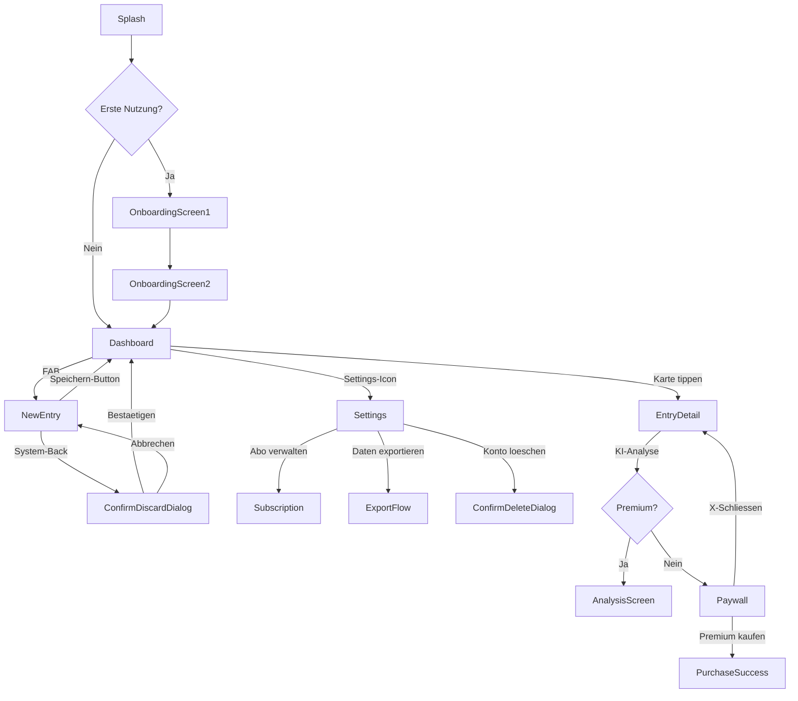

# Schicht 4 — Bildschirm-Karte: Was sieht und tut der Nutzer?

> **FIX AA3 (Audit 10) — Compose-Kotlin-Hinweis:** Die Compose-Patterns dieser Schicht (`@Composable`, `clickable`, `onClick`, `AlertDialog`) sind per Design Kotlin-only — Compose hat keine Java-API. Bei klassischen Java/XML-Layouts gelten andere Patterns (Activity/Fragment, `findViewById`, `setOnClickListener`, AlertDialog.Builder) — diese werden ergaenzend in Schicht 4b und 4c abgedeckt. Bei reinen XML-Layouts: `--include='*.xml'` fuer View-Definitionen, `--include='*.java'` fuer Activity-Logik.

## Zweck

Schicht 4 dokumentiert JEDE einzelne UI-Aktion: jeden Bildschirm, jeden Klick, jeden Side-Effect der zu einer Aktion fuehrt. Damit kann am Ende fuer eine Werbeaussage wie "Export mit einem Klick" praezise verifiziert werden ob das stimmt — oder ob es eigentlich 4 Klicks sind.

**Coverage-Beitrag fuer "was sieht der Nutzer": ~95 Prozent**

## 4.1 Compose-Screens finden

Top-Level-Screens haben typischerweise eines dieser Patterns:

```bash
# Pattern A: @Composable + Funktionsname endet auf "Screen"
grep -rn '@Composable' --include='*.kt' . | grep -E 'fun [A-Z][a-zA-Z]*Screen\('

# Pattern B: Datei-Name endet auf Screen.kt
find . -name '*Screen.kt' -not -path '*/test/*' -not -path '*/build/*'

# Pattern C: @Destination (compose-destinations Library)
grep -rn '@Destination' --include='*.kt' .

# Pattern D: @RootNavGraph oder @NavGraph
grep -rn '@RootNavGraph\|@NavGraph' --include='*.kt' .
```

Pro Screen dokumentieren:
- Datei + Pfad
- Funktions-Signatur (welche Parameter)
- Zugeordneter ViewModel (siehe Schicht 3)
- Default-Animation
- Welche Sub-Composables enthaelt er

## 4.2 Navigation-Graph komplett extrahieren

### Variant A — String-basierte Routes (Compose Navigation < 2.8)

```bash
grep -rn 'NavHost(\|composable("' --include='*.kt' .
grep -rn 'navController.navigate\|\.navigate(' --include='*.kt' .
```

### Variant B — Type-safe Routes (Compose Navigation 2.8+)

```bash
grep -rn 'composable<' --include='*.kt' .
grep -rn '@Serializable' --include='*.kt' . | grep -v 'data class.*Response\|Dto\|Request'
```

### Variant C — Sealed-class-Routes

```bash
grep -rn 'sealed class.*Screen\|sealed interface.*Screen\|sealed class.*Route\|object.*Screen.*\b' --include='*.kt' .
```

### Variant D — compose-destinations (raamcosta)

```bash
# Nach KSP-Build vorhanden:
find . -name 'NavGraphs.kt' -path '*/generated/*'
```

## 4.3 Click-Handler systematisch extrahieren

```bash
# Direkte onClick-Lambdas
grep -rn 'onClick = {' --include='*.kt' .
grep -rn 'onClick = ::' --include='*.kt' .

# clickable-Modifier
grep -rn '\.clickable {' --include='*.kt' .
grep -rn '\.clickable(' --include='*.kt' .

# combinedClickable (Long-Click → oft Debug-Menu, Easter-Egg)
grep -rn '\.combinedClickable\|onLongClick' --include='*.kt' .

# Selectable (Radio/Checkbox)
grep -rn '\.selectable\|\.toggleable' --include='*.kt' .

# Button-Spezifika
grep -rn 'IconButton\|TextButton\|FilledTonalButton\|OutlinedButton' --include='*.kt' .
```

Pro Klick im Screen dokumentieren:
- Auf welchem UI-Element (Button-Text, Icon, Karte, etc.)
- Was der Lambda macht (entweder direkt oder via VM-Funktion)
- Wohin der Klick fuehrt (Navigation? Dialog? Snackbar? State-Change?)

## 4.4 Side-Effects die Navigation/Aktionen ausloesen

```bash
# LaunchedEffect (haeufigster Trigger fuer "implizite" Navigation)
grep -rn 'LaunchedEffect' --include='*.kt' . -A 5

# Collect auf Event-Flows / Channels
grep -rn '\.collect {' --include='*.kt' . -A 3

# DisposableEffect (selten, aber moeglich)
grep -rn 'DisposableEffect' --include='*.kt' .

# SideEffect (Lifecycle-Effects)
grep -rn 'SideEffect' --include='*.kt' .
```

Wichtig: `LaunchedEffect(Unit)` oder `LaunchedEffect(uiState)` mit `navController.navigate` ist eine "unsichtbare Navigation" — passiert beim Render, nicht beim Klick. Im Audit MUSS das aufgefuehrt werden, sonst entsteht das falsche Bild dass man irgendwo "klicken" muss.

## 4.4b Wortlaut-Extraktion pro Screen (PFLICHT — Brueckenschlag zu Schicht 4b)

Fuer JEDEN Screen wird vor der eigentlichen Bildschirm-Karte ein Wortlaut-Block erstellt. Die Detail-Anleitung dazu liegt in `references/layer-4b-wortlaut-mapping.md`. Hier nur die fuer Schicht 4 relevanten Patterns:

```bash
# Welche String-Resources verwendet ein bestimmter Screen?
SCREEN=app/src/main/java/.../DashboardScreen.kt

# stringResource-Aufrufe in der Screen-Datei
grep -oE 'R\.string\.[a-zA-Z0-9_]+' "$SCREEN" | sort -u
grep -oE 'R\.plurals\.[a-zA-Z0-9_]+' "$SCREEN" | sort -u
grep -oE 'R\.array\.[a-zA-Z0-9_]+' "$SCREEN" | sort -u

# Aufrufe in zugehoerigem ViewModel (Snackbars/Toasts/Events kommen oft daher)
VM=app/src/main/java/.../DashboardViewModel.kt
grep -oE 'R\.string\.[a-zA-Z0-9_]+' "$VM" | sort -u

# Pro String-Key den Wortlaut in der Hauptsprache holen
for key in $(grep -oE 'R\.string\.[a-zA-Z0-9_]+' "$SCREEN" | sed 's/R\.string\.//' | sort -u); do
  grep "<string name=\"$key\"" app/src/main/res/values/strings.xml
done
```

Pflicht-Ausgabe pro Screen (zusaetzlich zur normalen Screen-Dokumentation):

```markdown
#### Wortlaute im Screen: <Name>

| UI-Element | String-Key | Wortlaut (DE 1:1) | Plurals/Args? | Quelle |
|-----------|-----------|-------------------|---------------|--------|
| TopBar-Title | `dashboard_title` | "Mein Tagebuch" | — | strings.xml:12 |
| FAB-ContentDescription | `dashboard_fab_cd` | "Neuen Eintrag erstellen" | — | strings.xml:88 |
| Empty-State-Headline | `dashboard_empty_title` | "Noch keine Eintraege" | — | strings.xml:102 |
| Counter-Plural | `plural_entries_count` | one: "%d Eintrag" / other: "%d Eintraege" | %d = Anzahl | plurals.xml:14 |
```

Wenn der Screen zusaetzlich Dialoge, Bottom-Sheets oder Snackbars enthaelt, werden DIESE Wortlaute in den entsprechenden Sub-Tabellen aus Schicht 4b dokumentiert — nicht hier.

## 4.5 Dialoge, Bottom-Sheets, Snackbars als Sub-Bildschirme

```bash
# Dialoge
grep -rn 'AlertDialog\|Dialog(\|BasicAlertDialog\|DatePickerDialog\|TimePickerDialog' --include='*.kt' .

# Bottom-Sheets
grep -rn 'ModalBottomSheet\|BottomSheetScaffold' --include='*.kt' .

# Snackbar-Actions
grep -rn 'snackbarHostState\|SnackbarResult' --include='*.kt' .

# Toasts (legacy)
grep -rn 'Toast.makeText' --include='*.kt' .
```

Diese sind oft eigene Sub-Flows mit eigenen Buttons. Im Audit als Sub-Eintraege unter dem Eltern-Screen dokumentieren.

**Beispiel:** Ein "Export"-Button oeffnet einen `ModalBottomSheet` mit Optionen "Als PDF", "Als JSON", "Als Mail teilen". Das sind 3 Sub-Aktionen unter "Export".

## 4.6 ViewModel-Events und UiEffects

Modernes Pattern: ViewModel sendet UiEffect (one-shot) ueber Channel/SharedFlow, Composable hoert via `LaunchedEffect`:

```kotlin
// VM:
private val _events = Channel<UiEvent>()
val events = _events.receiveAsFlow()

fun onSaveClicked() {
    viewModelScope.launch {
        repository.save(...)
        _events.send(UiEvent.NavigateBack)
    }
}

// Composable:
LaunchedEffect(Unit) {
    viewModel.events.collect { event ->
        when (event) {
            is UiEvent.NavigateBack -> navController.popBackStack()
            is UiEvent.ShowSnackbar -> ...
        }
    }
}
```

Suche-Patterns:

```bash
grep -rn 'sealed class UiEvent\|sealed class UiEffect\|sealed interface UiEvent' --include='*.kt' .
grep -rn 'Channel<\|MutableSharedFlow' --include='*.kt' .
grep -rn '_events\.send\|_uiEvent\.send\|_effect\.emit' --include='*.kt' .
```

## 4.7 Onboarding und First-Launch-Flows

```bash
# First-Launch-Flag
grep -rn 'first.*launch\|firstLaunch\|isFirstTime\|onboardingComplete\|hasSeenOnboarding' --include='*.kt' . -i

# Dynamischer startDestination
grep -rn 'startDestination' --include='*.kt' . -A 3

# Onboarding-Screens (oft Pattern: HorizontalPager + Page-Indicator)
grep -rn 'HorizontalPager\|rememberPagerState' --include='*.kt' .
```

Onboarding-Flow im Audit als eigener Block dokumentieren — er ist oft der erste Eindruck der App und hier stehen wichtige Werbeaussagen die man nicht vergessen darf!

## 4.8 BackHandler und Process-Death

```bash
grep -rn 'BackHandler' --include='*.kt' .
grep -rn 'rememberSaveable\|SavedStateHandle' --include='*.kt' .
```

`BackHandler` ueberschreibt das System-Back-Verhalten. Wenn vorhanden, MUSS dokumentiert werden was stattdessen passiert (z.B. "Beim System-Back wird ein Dialog 'Wirklich verlassen?' angezeigt").

## 4.9 ActivityResultLauncher / Externe Intents

```bash
grep -rn 'rememberLauncherForActivityResult\|ActivityResultContracts' --include='*.kt' .
grep -rn 'Intent\.ACTION_VIEW\|Intent\.ACTION_SEND\|Intent\.ACTION_PICK' --include='*.kt' .
grep -rn 'ACTION_CREATE_DOCUMENT\|ACTION_OPEN_DOCUMENT' --include='*.kt' .
```

Diese sind "Ausstiege" aus der App: User wird in Galerie / Kamera / Datei-Picker / Email-Client geleitet. Im Audit als External-Flow dokumentieren.

## 4.10 Permissions-Anfragen (Runtime)

```bash
grep -rn 'rememberPermissionState\|rememberMultiplePermissionsState' --include='*.kt' .
grep -rn 'requestPermissions\|checkSelfPermission' --include='*.kt' .
grep -rn 'shouldShowRequestPermissionRationale' --include='*.kt' .
```

Fuer jede Runtime-Permission im Audit dokumentieren:
- Wann wird sie angefragt (welcher Bildschirm, welcher Klick)
- Was passiert bei "Ablehnen"
- Was passiert bei "Niemals fragen"
- Wird ein Rationale-Screen gezeigt

## 4.11 Output: Bildschirm-Karte als Mermaid + Baum

### Mermaid-Diagramm fuer Gesamtuebersicht



### Baum-Notation fuer Detail

```
Dashboard (DashboardScreen.kt:42, DashboardViewModel)
├── Entry-Karte tippen
│   → navigate("entryDetail/{id}")
│   → EntryDetailScreen
├── FAB "+" (BottomEnd)
│   → viewModel.onNewEntryClicked()
│   → emit UiEvent.NavigateToNewEntry
│   → LaunchedEffect → navigate("newEntry")
├── TopBar Icon "Settings"
│   → navigate("settings")
├── TopBar Icon "Export"
│   → modalBottomSheetState.show()
│   → ExportBottomSheet
│       ├── "Als PDF teilen"
│       │   → viewModel.onExportPdfClicked()
│       │   → if (!isPremium) navigate("paywall") else exportPdf()
│       ├── "Als JSON" → ...
│       └── "Schliessen" → modalBottomSheetState.hide()
├── Pull-to-Refresh (oben ziehen)
│   → viewModel.refresh()
│   → keine Navigation, nur State-Update
└── BackHandler
    → finishAffinity() (App schliessen, kein Bestaetigungsdialog)
```

## 4.12 Pflicht-Pruefung: Werbeaussage "1-Klick"-Verifikation

Fuer jede Werbeaussage die "mit 1 Klick" oder "in einem Schritt" verspricht: tatsaechliche Klick-Anzahl im Audit zaehlen.

Beispiel:
- Werbung: "Tagebuch-Eintraege mit einem Klick exportieren"
- Tatsaechlich: Settings-Icon (1) → Export (2) → Format-Auswahl (3) → Bestaetigen (4) = **4 Klicks**
- → Audit-Befund: KRITISCH — UWG §5

## Output-Format fuer Schicht 4

```markdown
## Schicht 4 — Bildschirm-Karte

### Gesamt-Mermaid-Diagramm
[Mermaid-Block]

### Bildschirm-Inventar (N Screens)

#### 1. SplashScreen
- Datei: feature-splash/SplashScreen.kt:18
- VM: SplashViewModel
- Zweck: Erst-Launch-Routing (Onboarding vs Dashboard)
- Aktionen:
  - Auto-Navigation nach 1500ms
- Side-Effects: LaunchedEffect → navigate(...) basierend auf isOnboardingDone

#### 2. OnboardingScreen
- Datei: feature-onboarding/OnboardingScreen.kt:25
- VM: OnboardingViewModel
- Zweck: 5-Schritt-Tutorial fuer neue Nutzer
- Aktionen:
  - "Weiter"-Button → naechste Seite (HorizontalPager-Index +1)
  - "Ueberspringen" (TopRight) → navigate("dashboard") + setOnboardingDone()
  - "Premium-Trial starten" (auf Seite 5) → navigate("paywall?source=onboarding")
- Wortlaute pro Onboarding-Seite (PFLICHT — 1:1 zitieren):

  | Seite | Slot | String-Key | Wortlaut (DE) |
  |-------|------|-----------|---------------|
  | 1 | Headline | `onboarding_page1_title` | "Willkommen bei BestJournal" |
  | 1 | Body | `onboarding_page1_body` | "Halte deine Gedanken in einem privaten Tagebuch fest." |
  | 1 | CTA-Button | `onboarding_next` | "Weiter" |
  | 2 | Headline | `onboarding_page2_title` | "KI-gestuetzte Analyse" |
  | 2 | Body | `onboarding_page2_body` | "Unsere KI hilft dir, Muster in deinen Eintraegen zu erkennen." |
  | ... | ... | ... | ... |

#### 3. DashboardScreen
[Detail wie oben]

[... fuer alle Screens ...]

### Externe Entry-Points (Deep-Links, Share-Empfang)

| Trigger | Ziel-Screen | Was passiert |
|---------|------------|-------------|
| https://bestjournal.app/share?text=... | ShareReceiverActivity | Erstellt Eintrag mit geteiltem Text |
| widget-tap (App-Widget) | NewEntryScreen | Direktes Anlegen ueber Widget |
| Notification-Tap (Daily-Reminder) | DashboardScreen + Highlight | Hebt heutigen leeren Slot hervor |

### Click-Counter pro Werbeaussage

| Aussage | Versprochen | Gemessen | Befund |
|---------|------------|---------|--------|
| "Mit 1 Klick exportieren" | 1 Klick | 4 Klicks | KRITISCH UWG |
| "Schnellzugriff fuer neuen Eintrag" | 1 Klick | 1 Klick (FAB) | OK |
| ... | ... | ... | ... |
```

## Typische Fehlerquellen

- **Nested NavHosts**: Tab-Layouts mit eigenen NavHosts werden oft uebersehen. Suche nach mehr als einem NavHost.
- **Dialoge als "echte" Screens vergessen**: AlertDialog ist UX-technisch ein eigener Bildschirm, im Audit oft als "Klein-Detail" abgetan.
- **LaunchedEffect-Navigation**: Implizite Navigation passiert ohne Klick — leicht zu uebersehen.
- **Compose Multiplatform Screens**: Bei KMP koennen Screens in `commonMain` liegen, nicht in `androidMain`.
- **PendingIntent-Trigger**: Notification-Taps und Widget-Klicks starten App ueber Intents, nicht ueber Navigation.
