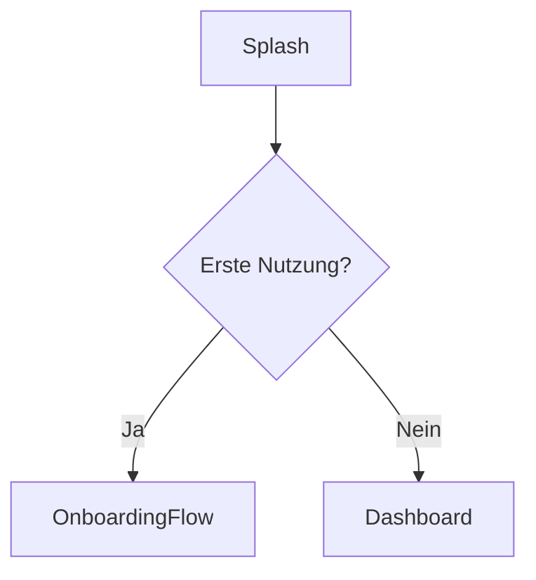
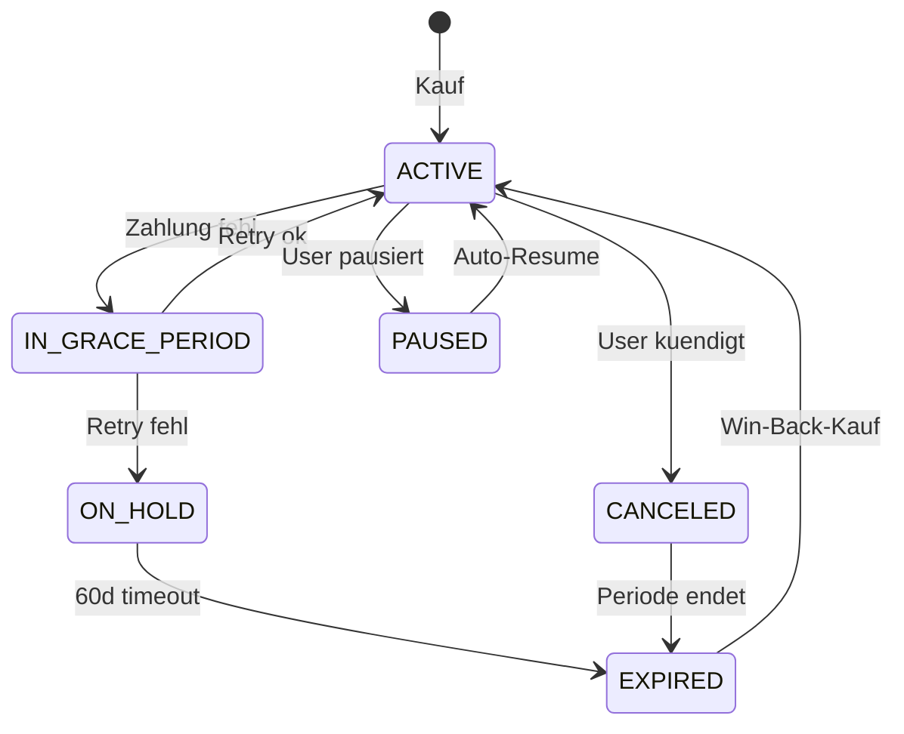

# App-Roentgen Audit-Bericht — <APP-NAME>

**Audit-Datum:** YYYY-MM-DD
**App-Version:** <Version-Code> / <Version-Name>
**Geprueftes Verzeichnis:** <Pfad>
**Audit durch:** app-roentgen Skill (Claude Code)

---

## Inhaltsverzeichnis

1. [Zusammenfassung fuer den Benutzer](#1-zusammenfassung-fuer-den-benutzer)
2. [Schicht 1 — Manifest-Analyse](#2-schicht-1--manifest-analyse)
3. [Schicht 2 — Dependency-Analyse](#3-schicht-2--dependency-analyse)
4. [Schicht 3 — Architektur-Inventar](#4-schicht-3--architektur-inventar)
5. [Schicht 4 — Bildschirm-Karte und Klick-Pfade](#5-schicht-4--bildschirm-karte-und-klick-pfade)
5b. [Schicht 4b — Wortlaut-Mapping pro Bereich](#5b-schicht-4b--wortlaut-mapping-pro-bereich) **(GRUNDLAGE FUER RECHTSSICHERHEIT)**
5c. [Schicht 4c — Translation-Context](#5c-schicht-4c--translation-context) **(GRUNDLAGE FUER UEBERSETZUNGS-SKILL)**
6. [Schicht 5 — Paywall-Tiefenanalyse](#6-schicht-5--paywall-tiefenanalyse) **(WICHTIGSTER ABSCHNITT)**
7. [Schicht 6 — Hidden Features](#7-schicht-6--hidden-features)
8. [Schicht 7 — Werbeaussage-vs-Feature-Matrix](#8-schicht-7--werbeaussage-vs-feature-matrix)
9. [Don't-Miss-Checkliste (66 Punkte)](#9-dont-miss-checkliste)
10. [Empfohlene naechste Schritte](#10-empfohlene-naechste-schritte)

---

## 1. Zusammenfassung fuer den Benutzer

**In leichtem Deutsch — 3-4 Saetze die ein Nicht-Programmierer versteht.**

Beispiel:
> Die App `BestJournal` hat 47 Bildschirme, 12 ViewModels, 8 Background-Jobs und ein
> komplexes Subscription-System mit 7 Paywall-Bildschirmen. Das wichtigste Ergebnis
> ist: 4 Werbeaussagen sind kritisch (UWG §5), 3 mittel-riskant. Vor dem Release
> muessen die kritischen Aussagen entweder praezisiert oder die App entsprechend
> erweitert werden.

**Audit-Statistik:**

| Bereich | Wert |
|---------|------|
| Kotlin-Dateien | N |
| Bildschirme (Screens) | N |
| ViewModels | N |
| UseCases | N |
| Permissions | N |
| Workers (Background) | N |
| Paywall-Bildschirme | N |
| Subscription-States behandelt | N von 7 |
| Werbeaussagen geprueft | N |
| Davon KRITISCH | n |
| Davon HOCH | n |
| Davon MITTEL | n |
| Davon OK | n |
| Wortlaute zitiert (Schicht 4b) | N |
| Maximale Menue-Tiefe | N Ebenen |
| Sprachen der App | N |
| Translation-Context Slot-Ueberlaengen | N |
| Translation-Context Glossar-Inkonsistenzen | N |
| Translation-Context Plural-Luecken pro Sprache | N |

---

## 2. Schicht 1 — Manifest-Analyse

### 2.1 Permissions

| Permission | Im Code genutzt | Datei:Zeile | Impliziertes Feature | Status |
|-----------|----------------|-------------|---------------------|--------|
| | | | | |

### 2.2 Activities

| Activity | Exported | Intent-Filter | Zweck |
|----------|----------|--------------|-------|
| | | | |

### 2.3 Services

| Service | Typ | Zweck |
|---------|-----|-------|
| | | |

### 2.4 BroadcastReceiver

| Receiver | Triggers | Zweck |
|----------|---------|-------|
| | | |

### 2.5 ContentProvider

| Provider | Authorities | Zweck |
|----------|-----------|-------|
| | | |

### 2.6 Deep-Links

| Scheme | Host | Path | Ziel-Activity |
|--------|------|------|--------------|
| | | | |

### 2.7 Backup-Konfiguration

- `allowBackup`: true/false
- `fullBackupContent`: ...
- `dataExtractionRules`: ...
- DSGVO-Bewertung: ...

### 2.8 Audit-Befunde Schicht 1

| # | Befund | Risiko | Datei | Empfehlung |
|---|--------|--------|-------|-----------|
| | | | | |

---

## 3. Schicht 2 — Dependency-Analyse

### 3.1 Build-System

- Gradle: ___
- AGP (Android Gradle Plugin): ___
- Kotlin: ___
- Compose Compiler: ___
- Min SDK: ___ — Target SDK: ___

### 3.2 Aktive Plugins

(Liste mit kurzer Erklaerung)

### 3.3 Capability-Cluster

#### Firebase
- ___

#### Persistenz
- ___

#### KI/ML
- ___

#### UI
- ___

(weitere)

### 3.4 Build-Variants und Flavors

___

### 3.5 Tote/Verdaechtige Dependencies

| Dependency | Grund |
|-----------|-------|
| | |

### 3.6 Audit-Befunde Schicht 2

| # | Befund | Risiko | Datei | Empfehlung |
|---|--------|--------|-------|-----------|
| | | | | |

---

## 4. Schicht 3 — Architektur-Inventar

### 4.1 ViewModels

| ViewModel | Bildschirm | Aktionen | Dependencies |
|-----------|-----------|---------|--------------|
| | | | |

### 4.2 Repositories

| Repository | Datenquellen | Hauptmethoden |
|-----------|-------------|--------------|
| | | |

### 4.3 UseCases / Interactors

| UseCase | Zweck | Aufgerufen von |
|---------|-------|---------------|
| | | |

### 4.4 Hilt-Module

| Modul | Component | Bereitgestellt |
|-------|-----------|---------------|
| | | |

### 4.5 Room-Datenmodell

| Entity | Tabelle | Felder | DSGVO-Sensibel |
|--------|--------|--------|---------------|
| | | | |

| DAO | Entity | Operationen |
|-----|--------|------------|
| | | |

### 4.6 Workers (Background-Jobs)

| Worker | Trigger | Constraints | Zweck |
|--------|---------|------------|-------|
| | | | |

### 4.7 State-Machines (Sealed Classes)

| Sealed | Subzustaende | Zugeordneter VM |
|--------|-------------|----------------|
| | | |

### 4.8 Application-Init

___

### 4.9 Audit-Befunde Schicht 3

| # | Befund | Risiko | Datei | Empfehlung |
|---|--------|--------|-------|-----------|
| | | | | |

---

## 5. Schicht 4 — Bildschirm-Karte und Klick-Pfade

### 5.1 Mermaid-Gesamtdiagramm



### 5.2 Bildschirm-Inventar (N Screens)

#### 5.2.1 Bildschirm: <Name>

- **Datei:** ___
- **VM:** ___
- **Zweck:** ___
- **Entry-Points:** ___
- **Aktionen / Klicks:**
  - Klick "X" → navigate(...)
  - ___
- **Side-Effects (LaunchedEffect, etc.):** ___
- **Werbeaussagen auf diesem Bildschirm:**
  - "..." (string-key:resource)
- **BackHandler-Verhalten:** ___

(Pro Bildschirm wiederholen)

### 5.3 Externe Entry-Points

| Trigger | Ziel-Screen | Was passiert |
|---------|------------|-------------|
| Deep-Link xxx | ___ | ___ |
| Widget-Tap | ___ | ___ |
| Notification-Tap | ___ | ___ |
| Share-Receiver | ___ | ___ |

### 5.4 Click-Counter pro Werbeaussage (1-Klick-Verifikation)

| Werbeaussage | Versprochen | Tatsaechlich | Befund |
|------------|------------|-------------|--------|
| "Mit 1 Klick exportieren" | 1 Klick | N Klicks | OK / KRIT |
| | | | |

### 5.5 Audit-Befunde Schicht 4

| # | Befund | Risiko | Datei | Empfehlung |
|---|--------|--------|-------|-----------|
| | | | | |

---

## 5b. Schicht 4b — Wortlaut-Mapping pro Bereich

> **GRUNDLAGE FUER RECHTSSICHERHEIT.** Alle Wortlaute werden 1:1 zitiert. Keine Paraphrasen, keine Zusammenfassungen, keine Kuerzungen. Jeder Wortlaut ist die exakte Zeichenfolge wie sie in der App erscheint — inkl. Satzzeichen, Sonderzeichen, Format-Platzhaltern, Umlauten.

### 5b.0 Vollstaendigkeits-Statistik

| Metrik | Wert |
|--------|------|
| Screens mit Wortlaut-Tabelle | N |
| Dialoge mit Wortlaut-Tabelle | N |
| Bottom-Sheets mit Wortlaut-Tabelle | N |
| Menue-Pfade dokumentiert (jede Ebene zaehlt einzeln) | N |
| Maximale Menue-Tiefe in der App | N Ebenen |
| Settings-Items dokumentiert | N |
| Snackbars/Toasts/Errors dokumentiert | N |
| Push-Notification-Templates dokumentiert | N |
| Plural-Resources dokumentiert | N |
| Array-Resources dokumentiert | N |
| Hardcoded Strings gefunden (sollte 0 sein) | N |
| String-Keys im Code referenziert | N |
| String-Keys in strings.xml definiert | N |
| Tote Keys | N |
| Fehlende Keys (referenziert aber nicht definiert) | N |
| Sprachen der App | N |

### 5b.1 Wortlaute pro Screen

Pro Screen eine eigene Tabelle. Reihenfolge: Top-Level-Screens zuerst, dann Sub-Screens.

#### Screen: <Name> (`<Datei.kt:Zeile>`)

| UI-Element | String-Key | Wortlaut (DE 1:1) | Wortlaut (EN 1:1) | Weitere Sprachen | Quelle |
|-----------|-----------|-------------------|-------------------|------------------|--------|
| TopBar-Title | | | | | |
| Headline | | | | | |
| Body-Text | | | | | |
| Primaer-Button | | | | | |
| Sekundaer-Button | | | | | |
| ContentDescription (a11y) | | | | | |

(Wiederholen pro Screen)

### 5b.2 Wortlaute pro Dialog

#### Dialog: <Name> (`<Datei.kt:Zeile>`)

| Slot | String-Key | Wortlaut (DE 1:1) | Wortlaut (EN 1:1) | Weitere Sprachen |
|------|-----------|-------------------|-------------------|------------------|
| Title | | | | |
| Body | | | | |
| Confirm-Button | | | | |
| Dismiss-Button | | | | |
| Neutral-Button | | | | |

(Wiederholen pro Dialog)

### 5b.3 Wortlaute pro Bottom-Sheet

#### Bottom-Sheet: <Name> (`<Datei.kt:Zeile>`)

| Slot | String-Key | Wortlaut (DE 1:1) | Wortlaut (EN 1:1) | Weitere Sprachen |
|------|-----------|-------------------|-------------------|------------------|
| Title | | | | |
| Beschreibung | | | | |
| Item 1 — Label | | | | |
| Item 1 — Beschreibung | | | | |
| Item N | | | | |
| Action-Button | | | | |

(Wiederholen pro Bottom-Sheet)

### 5b.4 Wortlaute pro Menue (REKURSIV — jede Ebene als eigene Zeile)

> **Pflicht:** Jedes Menue wird mit Breadcrumb-Pfad aufgeloest. Beliebige Tiefe. Keine Abkuerzungen.

#### Menue-Hierarchie 1: TopBar / Bottom Navigation / Drawer / Settings / ...

| Pfad (Breadcrumb) | Label-Wortlaut (DE 1:1) | Beschreibung-Wortlaut (DE 1:1) | Werte/Optionen (1:1) | Quelle |
|-------------------|------------------------|-------------------------------|---------------------|--------|
| Settings | "Einstellungen" | — | — | |
| Settings > Konto | "Konto" | "Anmeldung, Profil, Loeschung" | — | |
| Settings > Konto > Profil | "Profil" | "Name, Avatar, Bio" | — | |
| Settings > Konto > Profil > Anzeigename | "Anzeigename" | "So sehen dich andere Nutzer" | (frei) | |
| Settings > Konto > Profil > Anzeigename > Eingabe-Dialog | (siehe Dialog-Sektion 5b.2) | | | |
| Settings > Konto > Sicherheit | "Sicherheit" | "Zwei-Faktor, App-Sperre" | — | |
| Settings > Konto > Sicherheit > Zwei-Faktor | "Zwei-Faktor-Authentifizierung" | "Schuetzt dein Konto mit einem zweiten Faktor" | aus/ein | |
| Settings > Konto > Sicherheit > Zwei-Faktor > Backup-Codes | "Backup-Codes verwalten" | "10 Codes fuer den Notfall" | — | |
| ... (jede Tiefe) | | | | |

> Wenn die App mehrere unabhaengige Menues hat (z.B. TopBar-Overflow + Bottom-Nav + Drawer + Settings), bekommt JEDES eine eigene Hierarchie-Tabelle.

### 5b.5 Wortlaute pro Settings-Item

(Wenn die Settings als Compose-Custom-Layout statt PreferenceScreen umgesetzt sind, jedes Item einzeln auflisten.)

| Pfad | Item-Label | Beschreibung | Switch/Slider/Dropdown-Werte | Quelle |
|------|-----------|-------------|------------------------------|--------|
| Settings > Benachrichtigungen > Tagesreminder | "Tagesreminder" | "Erinnert dich jeden Abend an deinen Eintrag" | aus / ein | |
| Settings > Benachrichtigungen > Tagesreminder > Uhrzeit | "Uhrzeit" | "Wann soll der Reminder erscheinen?" | "20:00" (Format HH:mm) | |
| Settings > Design > Theme | "Design" | "Hell, Dunkel oder Systemvorgabe" | "Systemvorgabe" / "Hell" / "Dunkel" | |
| Settings > Datenschutz > Konto loeschen | "Konto loeschen" | "Alle Daten unwiderruflich entfernen" | (Dialog folgt) | |

### 5b.6 Wortlaute Snackbars, Toasts, Errors

| Trigger / Komponente | String-Key | Message-Wortlaut (DE 1:1) | Action-Button-Wortlaut | Quelle |
|---------------------|-----------|---------------------------|-----------------------|--------|
| | | | | |

### 5b.7 Wortlaute Push-Notifications

| Notification-Typ | Channel-Name | Title-Wortlaut | Body-Wortlaut | Action-Wortlaute | Quelle |
|------------------|-------------|----------------|---------------|------------------|--------|
| | | | | | |

### 5b.8 Wortlaute Empty/Loading-States

| Bereich | Slot | Wortlaut (DE 1:1) | Quelle |
|---------|------|-------------------|--------|
| Dashboard-Empty | Headline | | |
| Dashboard-Empty | Body | | |
| Dashboard-Empty | CTA | | |
| Detail-Loading | Loading-Text | | |
| | | | |

### 5b.9 Plurals und Array-Resources

| Key | Quantity / Index | Wortlaut (DE 1:1) | Wortlaut (EN 1:1) | Format-Argumente |
|-----|-----------------|-------------------|-------------------|------------------|
| `plural_xxx` | one | | | %d = Anzahl |
| `plural_xxx` | other | | | %d = Anzahl |
| `array_xxx` | [0] | | | — |
| `array_xxx` | [1] | | | — |

### 5b.10 Hardcoded Wortlaute (nicht-internationalisiert)

| Datei:Zeile | Wortlaut (DE 1:1) | Komponente | Risiko |
|-------------|-------------------|-----------|--------|
| | | | (wird in Schicht 7 bewertet) |

### 5b.11 Tote vs. fehlende String-Keys

#### Tote Keys (definiert aber nirgends verwendet)
```
key_a
key_b
...
```

#### Fehlende Keys (verwendet aber nicht definiert — Crash-Risiko!)
```
key_x
key_y
...
```

### 5b.12 Audit-Befunde Schicht 4b

| # | Befund | Risiko | Datei | Empfehlung |
|---|--------|--------|-------|-----------|
| | | | | |

---

## 5c. Schicht 4c — Translation-Context

> **GRUNDLAGE FUER UEBERSETZUNGS-SKILL.** Pro Wortlaut die Daten erfasst, die ein Uebersetzer braucht: Slot-Laenge, translatable-Flag, xliff:g-Tags, Notizen, CLDR-Plural-Vollstaendigkeit, HTML/CDATA, Format-Argument-Semantik, Glossar, Region-Differenzen, Du/Sie-Konsistenz.

### 5c.0 Vollstaendigkeits-Statistik

| Metrik | Wert |
|--------|------|
| Strings gesamt (Hauptsprache) | N |
| `translatable="false"` Strings | N |
| `xliff:g`-Tags verwendet | N |
| xmlns:xliff deklariert | JA / NEIN |
| Format-Strings OHNE xliff:g (Kandidaten) | N |
| Strings mit XML-Kommentar (Uebersetzer-Note) | N / Gesamt (X%) |
| Format-Strings OHNE Kommentar | N |
| Plural-Keys gesamt | N |
| Plural-Sprachen mit fehlenden Quantitaeten | N (Liste) |
| Strings mit HTML-Tags | N |
| Strings mit CDATA | N |
| Strings mit HTML-Entities | N |
| Positional-Format-Strings (%1\$s, %2\$d) | N |
| Generic-Format-Strings (%s, %d — sollten positional sein) | N |
| Glossar-Begriffe identifiziert | N |
| Glossar-Inkonsistenzen (gleiches DE-Wort, verschiedene EN-Uebersetzungen) | N |
| Regional-Varianten-Paare | N |
| Identische Regional-Varianten (Verdacht fehlende Lokalisierung) | N |
| Strings ueber Slot-Maxlaenge | N (Liste) |
| Du/Sie-Mischanrede (Deutsch) | JA / NEIN |

### 5c.1 Slot-Laengen-Audit

| String-Key | Wortlaut (DE) | Slot | Laenge (DE) | Max | Status |
|-----------|---------------|------|-------------|-----|--------|
| | | | | | |

### 5c.2 Nicht-uebersetzbare Strings (translatable="false")

| Key | Wortlaut | Begruendung (vermutet) |
|-----|----------|----------------------|
| | | |

**Erwartete Kandidaten die fehlen** (vom Skill geschaetzt):
- ...

### 5c.3 xliff:g-Tags

xmlns:xliff deklariert: JA / NEIN

| String-Key | Wortlaut mit xliff:g | id | example |
|-----------|----------------------|------|---------|
| | | | |

**Format-Strings ohne xliff:g (Kandidaten):**
- ...

### 5c.4 Uebersetzer-Notizen (XML-Kommentare)

Strings mit Kommentar: N / Gesamt (X%)

| Key | Wortlaut | Kommentar |
|-----|----------|-----------|
| | | |

**Format-Strings ohne Kommentar:**
- ...

### 5c.5 CLDR-Plural-Audit

| Plural-Key | DE | EN | RU | AR | ZH | ... | Status |
|-----------|-----|-----|-----|-----|-----|-----|--------|
| | | | | | | | |

### 5c.6 HTML- und CDATA-Inhalte

| Key | Wortlaut | HTML-Tags | CDATA |
|-----|----------|-----------|-------|
| | | | |

### 5c.7 Format-Argumente

| Key | Wortlaut (DE) | Argumente | Argument-Bedeutung | Beispiel-Render |
|-----|---------------|-----------|--------------------|-----------------|
| | | | | |

### 5c.8 Glossar (Top-30 Begriffe — konsistent uebersetzen)

| Begriff (DE) | Vorkommen | Aktuelle Uebersetzung EN | Vorschlag konsistent | Anmerkung |
|-------------|-----------|--------------------------|---------------------|-----------|
| | | | | |

### 5c.9 Region-Differenzen

| Sprach-Paar | Identische Strings | Differenzen | Status |
|-------------|-------------------|-------------|--------|
| | | | |

### 5c.10 Du/Sie-Konsistenz (Deutsch)

| Anrede-Form | Anzahl Treffer | Beispiele |
|------------|----------------|-----------|
| | | |

**Befund:** Konsistent / Mischanrede

### 5c.11 Audit-Befunde Schicht 4c

| # | Befund | Risiko | Datei | Empfehlung |
|---|--------|--------|-------|-----------|
| | | | | |

---

## 6. Schicht 5 — Paywall-Tiefenanalyse

> **WICHTIGSTER ABSCHNITT — bekommt eigenes Inhaltsverzeichnis und Detail-Auswertung**

### 6.0 Paywall-Inhaltsverzeichnis

1. Paywall-Architektur-Uebersicht
2. Inventar aller Paywall-Bildschirme (N)
3. Subscription-State-zu-UI-Mapping
4. Trial- und Promo-Mechaniken
5. Cancel-Flow (Churn)
6. Edge-Case-Pruefungen
7. Pflichtangaben pro Paywall-Bildschirm
8. Server-Side Validation
9. Audit-Befunde Paywall

### 6.1 Paywall-Architektur-Uebersicht



### 6.2 Inventar aller Paywall-Bildschirme

#### 6.2.1 Hauptpaywall

| Feld | Wert |
|------|------|
| Datei | PaywallScreen.kt:___ |
| VM | PaywallViewModel.kt:___ |
| Trigger | ___ |
| Plaene angezeigt | Monthly: __, Yearly: __, Promo: __ |
| Buttons | "Premium starten", "Spaeter", "Wiederherstellen" |

(Sub-Tabelle Pflichtangaben — siehe 6.7)

#### 6.2.2 Onboarding-Paywall

___

#### 6.2.3 Cancel-Survey

___

(Pro Paywall-Bildschirm wiederholen)

### 6.3 Subscription-State-zu-UI-Mapping

| State | UI-Bildschirm/Komponente | Datei | Status |
|-------|------------------------|-------|--------|
| ACTIVE | | | |
| IN_GRACE_PERIOD | | | |
| ON_HOLD | | | |
| PAUSED | | | |
| CANCELED | | | |
| EXPIRED | | | |
| PENDING | | | |

### 6.4 Trial- und Promo-Mechaniken

| Offer-Tag | Phasen | Was sieht der Nutzer | Audit-Pruefung |
|-----------|--------|---------------------|---------------|
| | | | |

### 6.5 Cancel-Flow (Churn)

- Anzahl Klicks bis Cancel: ___
- Cancel-Button-Visualitaet: ___
- Survey-Reasons: ___
- DSGVO-konform: ja/nein
- Bestaetigungs-Text: ___

### 6.6 Edge-Case-Pruefungen

| Edge-Case | Behandelt? | Datei | Befund |
|-----------|----------|-------|--------|
| acknowledgePurchase aufgerufen | | | |
| PurchaseState.PENDING gehandhabt | | | |
| ITEM_ALREADY_OWNED Recovery | | | |
| Restore-Purchase-Button vorhanden | | | |
| BILLING_UNAVAILABLE Error-Screen | | | |
| includeSuspendedSubscriptions=true | | | |
| obfuscatedAccountId gesetzt | | | |
| Reconnect nach Background | | | |

### 6.7 Pflichtangaben pro Paywall-Bildschirm

| Pflichtangabe | Hauptpaywall | Onboarding-PW | Trial-PW | Promo-PW | Win-Back-PW |
|--------------|-------------|--------------|---------|---------|-------------|
| Exakter Preis mit Waehrung | | | | | |
| Abrechnungsintervall | | | | | |
| Auto-Verlaengerung | | | | | |
| Kuendigung jederzeit | | | | | |
| Trial-Ende + Folgepreis | n/a | | | n/a | n/a |
| Streichpreis-Realitaet | n/a | n/a | n/a | | n/a |
| Jahresgesamtbetrag | | | | | |

### 6.8 Server-Side Validation

- Cloud Function: ___
- Felder die abgefragt werden: ___
- Caching-Verhalten: ___
- Offline-Strategie: ___

### 6.9 Audit-Befunde Schicht 5

| # | Befund | Risiko | Datei | Empfehlung |
|---|--------|--------|-------|-----------|
| | | | | |

---

## 7. Schicht 6 — Hidden Features

### 7.1 Background-Jobs (WorkManager)

| Worker | Trigger | Periodic | Constraints | Zweck | Network? |
|--------|--------|----------|------------|-------|---------|
| | | | | | |

### 7.2 Widgets

| Widget | Layout | Update-Frequenz | Klick-Aktion |
|--------|-------|----------------|-------------|
| | | | |

### 7.3 Quick-Settings-Tile / App-Shortcuts

___

### 7.4 Notification-Channels

| Channel-ID | Name | Importance | Beispiel-Notifications |
|-----------|------|----------|---------------------|
| | | | |

### 7.5 Accessibility Service / Print / NFC / Boot-Auto-Start

___

### 7.6 Feature-Flags / Remote Config

| Flag-Key | Default | Wo abgefragt | Was schaltet er |
|---------|---------|-------------|----------------|
| | | | |

### 7.7 Debug-Menus / A/B-Tests

___

### 7.8 Account-Deletion (DSGVO-Pflicht)

- In-App-Loeschung: ja/nein, Datei: ___
- Web-URL fuer Loeschung: ja/nein, URL: ___
- Loescht alle Daten: ja/nein
- Bestaetigung mit Unwiderruflichkeitshinweis: ja/nein

### 7.9 Backup-Logik

___

### 7.10 Sharing-Empfaenger / In-App-Review / Foreground Services

___

### 7.11 Health Connect / Credential Manager / In-App-Updates

___

### 7.12 Audit-Befunde Schicht 6

| # | Befund | Risiko | Datei | Empfehlung |
|---|--------|--------|-------|-----------|
| | | | | |

---

## 8. Schicht 7 — Werbeaussage-vs-Feature-Matrix

### 8.1 Aussagen-Inventar

| Quelle | Anzahl Aussagen | KRIT | HOCH | MITTEL | OK |
|--------|---------------|------|------|--------|----|
| strings.xml (Hauptsprache) | | | | | |
| strings.xml (Uebersetzungen, X Sprachen) | | | | | |
| Onboarding-Screens | | | | | |
| Paywall-Screens | | | | | |
| Push-Notifications | | | | | |
| Settings | | | | | |
| Store-Listing (manuell) | TBD | TBD | TBD | TBD | TBD |

### 8.2 Hauptmatrix (sortiert nach Risiko: KRIT → HOCH → MITTEL → OK)

| # | Aussage (woertlich) | Quelle | Code-Realitaet | Luecke | Risiko + Norm | Fix-Vorschlag |
|---|---------------------|--------|---------------|--------|--------------|---------------|
| | | | | | | |

### 8.3 Multi-Sprach-Konsistenz

| Aussage-Key | DE | EN | FR | PT | ES | ... |
|------------|----|----|----|----|----|----|
| | | | | | | |

### 8.4 Cancel-Flow-Audit

| Pruefpunkt | Status |
|-----------|--------|
| Anzahl Klicks bis Cancel | ___ |
| Cancel-Button gleich gross wie Purchase | JA / NEIN |
| Survey-Reasons in DS-Erklaerung | JA / NEIN |
| Win-Back-Versuche nach Cancel | 0 / 1 / >1 |
| Bestaetigungs-Text klar | JA / NEIN |
| DE-Pflicht-Kuendigungsbutton | JA / NEIN / n/a |

### 8.5 Empfohlene Fix-Reihenfolge

1. **KRIT-1**: ___
2. **KRIT-2**: ___
3. **HOCH-1**: ___
4. ...

### 8.6 Audit-Befunde Schicht 7

| # | Befund | Risiko | Datei | Empfehlung |
|---|--------|--------|-------|-----------|
| | | | | |

---

## 9. Don't-Miss-Checkliste

> Pflicht-Pruefung — alle 50 Punkte ausgefuellt? Siehe `references/dont-miss-checklist.md` fuer Detail.

### Block A — Manifest (8)
- [ ] A1. AndroidManifest.xml gelesen und alle Permissions katalogisiert?
- [ ] A2. Alle Activities mit Intent-Filtern dokumentiert?
- [ ] A3. Alle Services dokumentiert?
- [ ] A4. Alle BroadcastReceiver dokumentiert?
- [ ] A5. Alle ContentProvider dokumentiert?
- [ ] A6. Alle Deep-Links und URL-Schemes katalogisiert?
- [ ] A7. Backup-Konfiguration geprueft?
- [ ] A8. Mehrere Manifest-Varianten geprueft?

### Block B — Dependencies (6)
- [ ] B1-B6 (siehe Detail)

### Block C — Architektur (7)
- [ ] C1-C7

### Block D — Bildschirme und Flows (8)
- [ ] D1-D8

### Block E — Paywall (10)
- [ ] E1-E10

### Block F — Hidden Features (10)
- [ ] F1-F10

### Block G — Compliance und Privacy (6)
- [ ] G1-G6

### Block H — Werbeaussagen-Audit (5)
- [ ] H1-H5

### Block I — Wortlaut-Erfassung 1:1 (8)
- [ ] I1. Fuer JEDEN Screen eine Wortlaut-Tabelle mit allen UI-Elementen erstellt?
- [ ] I2. Fuer JEDEN Dialog ALLE Slots zitiert (Title, Body, Buttons)?
- [ ] I3. Fuer JEDES Bottom-Sheet alle Items mit Label + Beschreibung zitiert?
- [ ] I4. Menue-Hierarchien REKURSIV ausgerollt — JEDE Untermenue-Ebene mit Breadcrumb-Pfad?
- [ ] I5. Settings-Items einzeln mit Label + Beschreibung + Werten dokumentiert?
- [ ] I6. Snackbars, Toasts, Error-/Empty-/Loading-States mit Wortlaut + Action-Buttons zitiert?
- [ ] I7. Push-Notifications mit Channel-Name + Title + Body + Actions zitiert?
- [ ] I8. Plurals, Array-Resources, Format-Strings, hardcoded Strings erfasst + Differenz-Analyse?

### Block J — Translation-Context (8)
- [ ] J1. Slot-Laengen-Audit durchgefuehrt — alle Wortlaute gegen UI-Slot-Maxlaenge geprueft?
- [ ] J2. translatable="false" Strings erfasst und auf Plausibilitaet geprueft?
- [ ] J3. xliff:g-Tags erfasst — xmlns:xliff korrekt deklariert? Format-Strings ohne xliff:g als Kandidaten markiert?
- [ ] J4. XML-Kommentare als Uebersetzer-Notizen erfasst, fehlende Notes bei Format-Strings flagged?
- [ ] J5. CLDR-Plural-Vollstaendigkeit pro Sprache geprueft — fehlende Quantitaeten aufgelistet?
- [ ] J6. HTML/CDATA/Entity-Inhalte erfasst und Uebersetzer-Hinweis aufgenommen?
- [ ] J7. Format-Argumente semantisch dokumentiert (%1$s = was, %2$d = was)?
- [ ] J8. Glossar-Begriffe erkannt, Konsistenz-Inkonsistenzen + Region-Differenzen + Du/Sie-Konsistenz geprueft?

**Gesamt: ___ / 66 gepruefft, ___ NICHT_VERIFIZIERT mit Begruendung**

---

## 10. Empfohlene naechste Schritte

### Vor dem Release (KRITISCH)

1. ___
2. ___

### Innerhalb 2 Wochen (HOCH)

1. ___
2. ___

### Im naechsten Release-Zyklus (MITTEL)

1. ___
2. ___

### Frank-Aufgaben (manuelle Schritte)

1. **Store-Listing-Audit**: Long Description und Short Description der Google Play Console Werbeaussagen-Pruefung unterziehen
2. **Datenschutzerklaerung**: Pruefen ob alle DSGVO-relevanten Permissions und Cancel-Survey-Reasons aufgefuehrt sind
3. **Account-Loeschung Web-URL**: Falls fehlend, eigene Webseite mit Account-Loeschungs-Formular erstellen

---

**Audit-Ende.** Bei Fragen oder Unklarheiten — die mit "UNKLAR" markierten Stellen
des Berichts sollten manuell geprueft werden bevor rechtliche Schritte eingeleitet werden.
