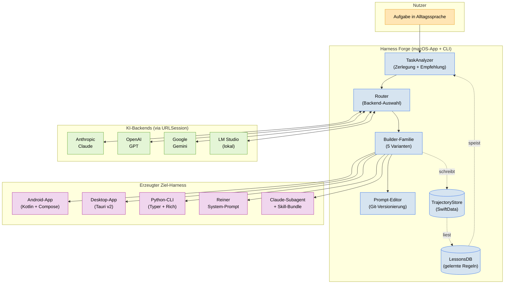

# Harness Forge

> **Eine Fabrik fuer KI-Harnesse.**
> Du beschreibst deine Aufgabe in Alltagssprache. Harness Forge waehlt
> selbststaendig die passende Form — Android-App, Desktop-App, CLI,
> Prompt-Artefakt oder Claude-Subagent — und baut sie vollstaendig.

[](https://www.apple.com/macos/)
[](https://swift.org)
[](./Tests)
[](./TODO.md)
[](./LICENSE)

---

## Inhaltsverzeichnis

- [Worum es geht](#worum-es-geht)
- [5-Minuten-Quickstart](#5-minuten-quickstart)
- [CLI-Referenz](#cli-referenz)
- [Architektur auf einen Blick](#architektur-auf-einen-blick)
- [Projekt-Struktur](#projekt-struktur)
- [Die fuenf Harness-Formen](#die-fuenf-harness-formen)
- [Entwickeln und Testen](#entwickeln-und-testen)
- [Was Harness Forge NICHT tut](#was-harness-forge-nicht-tut)

---

## Worum es geht

Die meisten Anleitungen zum Bau von KI-Agenten lesen sich wie Kochrezepte:
"Nimm LangChain, werf da OpenAI rein, dekoriere mit Prompts." Das Ergebnis ist
oft fragil, schwer zu warten und in drei Monaten ein Stueck Technical Debt.

Harness Forge dreht den Spiess um: Du sagst, **was** du brauchst — nicht **wie**
es gebaut werden soll. Das System entscheidet selbst anhand nachvollziehbarer
Kriterien (Zielumgebung, Interaktivitaet, Offline-Faehigkeit, Datenquellen, …),
welche Form am sinnvollsten ist, und baut sie komplett durch.

**Jeder erzeugte Harness bringt automatisch mit:**

- Eine AGENTS.md auf Deutsch
- Austauschbare KI-Backends (Anthropic, OpenAI, Google, lokale Modelle)
- Prompt-Versionierung mit 1-Klick-Rollback
- Trajektorien-Logging als lokale Datenbank
- Selbstreflexions-Schleifen und automatisch gelernte Fehler-Regeln
- Kosten- und Loop-Schutz

---

## 5-Minuten-Quickstart

### Voraussetzungen

- macOS 14 Sonoma oder neuer
- Xcode 16 (bringt Swift 6 und Swift Testing mit)
- Git

### Bauen und starten

```bash
git clone https://github.com/Pepsi1978/proggs.git
cd proggs/harness-forge

# Abhaengigkeiten aufloesen
swift package resolve

# Alles kompilieren
swift build

# 146 Tests laufen lassen
swift test

# CLI
swift run forge --help

# SwiftUI-App
swift run HarnessForgeApp
```

### Ersten Harness erzeugen (mit API-Key)

```bash
export ANTHROPIC_API_KEY="sk-ant-..."
swift run forge new "Baue mir einen Reisebegleiter fuer Packrafting-Touren in Schweden"
```

Ohne API-Key laeuft der Analyzer gegen LM Studio auf `localhost:1234`.

---

## CLI-Referenz

| Kommando | Beschreibung |
|----------|--------------|
| `forge new "<task>"` | Volle Pipeline: analysiere → empfehle → baue |
| `forge new "<task>" --analyzeOnly` | Trockenlauf ohne Bau |
| `forge new "<task>" --type tauri_desktop` | Empfehlung ueberstimmen |
| `forge analyze "<task>"` | Nur Entscheidungs-Matrix anzeigen |
| `forge list` | Alle generierten Harnesse in `~/proggs/` listen |
| `forge edit <slug>` | Prompt im `$EDITOR` oeffnen, auto-commit |
| `forge rollback <slug> <hash>` | Prompt auf frueher gespeicherte Version zurueckrollen |
| `forge rollback <slug>` | Verfuegbare Versionen listen |

---

## Architektur auf einen Blick



---

## Projekt-Struktur

```
harness-forge/
├── Package.swift              SPM-Manifest (Swift 6, macOS 14+)
├── AGENTS.md                  Projekt-Verfassung (deutsch, 6 Prinzipien)
├── README.md                  Diese Datei
├── TODO.md                    14-Schritte-Plan (alle erledigt)
│
├── Sources/
│   ├── HarnessForgeCore/                 Kern: LLM + Persistenz + Versioning
│   │   ├── LLMClient.swift, Router.swift, KeychainStorage.swift
│   │   ├── Backends/                         4 Backends via URLSession
│   │   ├── Persistence/                      SwiftData: Trajectory, Interaction, Lesson
│   │   ├── PromptEditor/                     Git-basiertes Prompt-Versioning
│   │   ├── Reflection/                       ReflectionLoop
│   │   └── Models/                           Sendable-DTOs
│   │
│   ├── HarnessForgeLayers/               Die 6 Schichten
│   │   ├── Constraint/    Context/    Execution/
│   │   └── Verification/  Lifecycle/  Meta/
│   │
│   ├── HarnessForgeBuilders/             Die 5 Builder
│   │   ├── TaskAnalyzer/                     Herzstueck
│   │   ├── PurePromptBuilder/                einfachster Builder
│   │   ├── PythonCLIBuilder/                 Typer + Rich + httpx
│   │   ├── TauriDesktopBuilder/              Rust + Svelte 5 + Tauri v2
│   │   ├── AndroidKotlinBuilder/             Compose + Material 3
│   │   └── ClaudeSubagentBuilder/            Agent + Skill + install.sh
│   │
│   ├── ForgeCLI/                         `swift run forge …`
│   │   └── Commands/                         5 Subcommands
│   │
│   └── HarnessForgeApp/                  SwiftUI macOS-App
│       └── Views/                            Root, Sidebar, Matrix, Settings
│
├── Tests/                     146 Tests, Swift-Testing-Framework
│
├── docs/
│   └── first-harness.md       Ergebnis des ersten E2E-Dogfoodings
│
└── .forge/ (runtime)          Lokale Daten (gitignored)
    ├── prompts.git/             Git-Repo fuer Prompt-Versionen
    ├── trajectories.sqlite
    └── lessons.sqlite
```

---

## Die fuenf Harness-Formen

| Form | Ideal fuer | Beispielaufgabe |
|------|-----------|-----------------|
| **Android-App** | Offline-Touren, Sensoren, unterwegs | "Fitness-Coach mit Herzfrequenz" |
| **Desktop-App** (Tauri) | Grosse Arbeitsbereiche, lokale Dateien | "Wissensdatenbank durchsuchen" |
| **Python-CLI** | Automatisierung, Entwickler-Tools | "Logdateien nach Mustern filtern" |
| **Reiner Prompt** | Einmalige Denkaufgabe | "Brainstorming fuer Marken-Namen" |
| **Claude-Subagent** | Spezialist innerhalb von Claude Code | "Commit-Message-Schreiber" |

Welche Form du bekommst, entscheidet der `TaskAnalyzer` anhand einer sechs-
dimensionalen Punktebewertung. Die Begruendung landet als Markdown-Dokument
neben dem erzeugten Harness — du kannst die Entscheidung jederzeit nachlesen
und ueberstimmen (`forge new --type python_cli`).

---

## Entwickeln und Testen

### Alles bauen

```bash
swift build
```

### Alle Tests

```bash
swift test
```

Wir nutzen das **Swift-Testing-Framework** (nicht XCTest). Beispiel:

```swift
import Testing
@testable import HarnessForgeCore

@Test("Versionsnummer ist korrekt")
func versionIsSet() {
    #expect(HarnessForgeCore.version == "0.1.0")
}
```

### Coverage

```bash
swift test --enable-code-coverage
```

---

## Was Harness Forge NICHT tut

- **Keine neuen GitHub-Repos anlegen.** Alles geht in `Pepsi1978/proggs` als
  Unterordner mit sprechendem Namen.
- **Keine Python-GUIs erzeugen.** Python ist fuer CLI-Builds OK, aber nicht
  fuer visuelle Oberflaechen.
- **Keine nackten API-Keys irgendwo ablegen.** Alles ueber macOS Keychain.
- **Keine stillen Erfolgsmeldungen.** Wenn etwas korrigiert wird, siehst du es.
- **Keine Magie.** Jede Entscheidung ist nachvollziehbar und begruendet.

---

## Lizenz

MIT.

---

*Teil des Mono-Repos [`Pepsi1978/proggs`](https://github.com/Pepsi1978/proggs).*
