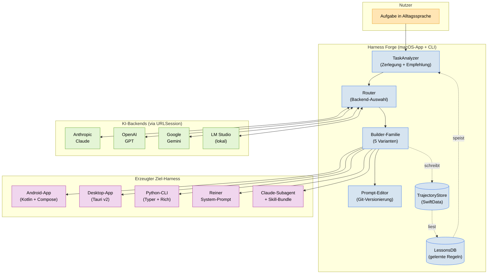

# Harness Forge

> **Eine Fabrik fuer KI-Harnesse.**
> Du beschreibst deine Aufgabe in Alltagssprache. Harness Forge waehlt
> selbststaendig die passende Form — Android-App, Desktop-App, CLI,
> Prompt-Artefakt oder Claude-Subagent — und baut sie vollstaendig.

[](https://www.apple.com/macos/)
[](https://swift.org)
[](./LICENSE)
[](./TODO.md)

---

## Inhaltsverzeichnis

- [Worum es geht](#worum-es-geht)
- [5-Minuten-Quickstart](#5-minuten-quickstart)
- [Architektur auf einen Blick](#architektur-auf-einen-blick)
- [Projekt-Struktur](#projekt-struktur)
- [Die fuenf Harness-Formen](#die-fuenf-harness-formen)
- [Entwickeln und Testen](#entwickeln-und-testen)
- [Roadmap](#roadmap)
- [Warum Swift, warum SPM, warum macOS-only](#warum-swift-warum-spm-warum-macos-only)

---

## Worum es geht

Die meisten Anleitungen zum Bau von KI-Agenten lesen sich wie Kochrezepte:
"Nimm LangChain, werf da OpenAI rein, dekoriere mit Prompts." Das Ergebnis ist
oft fragil, schwer zu warten und in drei Monaten ein Stueck Technical Debt.

Harness Forge dreht den Spiess um: Du sagst, **was** du brauchst — nicht **wie**
es gebaut werden soll. Das System entscheidet selbst anhand nachvollziehbarer
Kriterien (Zielumgebung, Interaktivitaet, Offline-Faehigkeit, Datenquellen, …),
welche Form am sinnvollsten ist, und baut sie komplett durch.

**Jeder erzeugte Harness bringt automatisch mit:**

- Eine AGENTS.md auf Deutsch
- Austauschbare KI-Backends (Anthropic, OpenAI, Google, lokale Modelle)
- Prompt-Versionierung mit 1-Klick-Rollback
- Trajektorien-Logging als lokale Datenbank
- Selbstreflexions-Schleifen und automatisch gelernte Fehler-Regeln
- Kosten- und Loop-Schutz

---

## 5-Minuten-Quickstart

### Voraussetzungen

- macOS 14 Sonoma oder neuer
- Xcode 16 (bringt Swift 6 und Swift Testing mit)
- Git

### Bauen und starten

```bash
git clone https://github.com/Pepsi1978/proggs.git
cd proggs/harness-forge

# Abhaengigkeiten aufloesen
swift package resolve

# Alles kompilieren
swift build

# Tests laufen lassen
swift test

# CLI starten (aktuell nur Smoke-Test)
swift run forge --help
```

### Ersten Harness erzeugen

```bash
swift run forge new "Baue mir einen Reisebegleiter fuer Packrafting-Touren in Schweden"
```

*(Funktioniert erst ab Step 5 — aktuell nur Geruest vorhanden.)*

---

## Architektur auf einen Blick



**Legende** — Farblich kodiert:
*Orange* = Nutzereingabe, *Blau* = Harness Forge, *Gruen* = externe KI, *Violett* = erzeugte Artefakte.

---

## Projekt-Struktur

```
harness-forge/
├── Package.swift                    SPM-Manifest
├── AGENTS.md                        Die Verfassung (deutsch)
├── README.md                        Diese Datei
├── TODO.md                          14-Schritte-Plan
├── .gitignore
├── .swift-version                   "6.0"
│
├── Sources/
│   ├── HarnessForgeCore/            Kern: LLM-Abstraktion, Router, Persistenz
│   │   ├── HarnessForgeCore.swift       Versions-Konstante + Public API
│   │   ├── LLMClient.swift              ab Step 2
│   │   ├── Router.swift                 ab Step 2
│   │   ├── Backends/                    ab Step 2
│   │   ├── Persistence/                 ab Step 3
│   │   └── Reflection/                  ab Step 3
│   │
│   ├── HarnessForgeLayers/          Die 6 Schichten als eigenes Modul
│   │   ├── Constraint/                  L1 — ab Step 4
│   │   ├── Context/                     L2 — ab Step 4
│   │   ├── Execution/                   L3 — ab Step 4
│   │   ├── Verification/                L4 — ab Step 4
│   │   ├── Lifecycle/                   L5 — ab Step 4
│   │   └── Meta/                        Meta — ab Step 4
│   │
│   ├── HarnessForgeBuilders/        5 Builder fuer die 5 Harness-Formen
│   │   ├── TaskAnalyzer/                ab Step 5
│   │   ├── PurePromptBuilder/           ab Step 6
│   │   ├── PythonCLIBuilder/            ab Step 7
│   │   ├── TauriDesktopBuilder/         ab Step 8
│   │   ├── AndroidKotlinBuilder/        ab Step 9
│   │   └── ClaudeSubagentBuilder/       ab Step 10
│   │
│   ├── ForgeCLI/                    CLI-Frontend — `swift run forge …`
│   │   └── ForgeApp.swift               ab Step 12
│   │
│   └── HarnessForgeApp/             SwiftUI-App — ab Step 13
│       └── HarnessForgeApp.swift
│
├── Tests/
│   ├── HarnessForgeCoreTests/
│   ├── HarnessForgeLayersTests/
│   └── HarnessForgeBuildersTests/
│
└── .forge/                          Lokale Laufzeit-Daten (gitignored)
    ├── prompts.git/                     Git-Repo fuer Prompt-Versionen
    ├── trajectories.sqlite              Interaktions-Logs
    └── lessons.sqlite                   Gelernte Fehler-Regeln
```

---

## Die fuenf Harness-Formen

| Form | Ideal fuer | Beispielaufgabe |
|------|-----------|-----------------|
| **Android-App** | Offline-Touren, Sensoren, unterwegs | "Fitness-Coach mit Herzfrequenz" |
| **Desktop-App** (Tauri) | Grosse Arbeitsbereiche, lokale Dateien | "Wissensdatenbank durchsuchen" |
| **Python-CLI** | Automatisierung, Entwickler-Tools | "Logdateien nach Mustern filtern" |
| **Reiner Prompt** | Einmalige Denkaufgabe | "Brainstorming fuer Marken-Namen" |
| **Claude-Subagent** | Spezialist innerhalb von Claude Code | "Commit-Message-Schreiber" |

Welche Form du bekommst, entscheidet der `TaskAnalyzer` anhand einer sechs-
dimensionalen Punktebewertung. Die Begruendung landet als Markdown-Dokument
neben dem erzeugten Harness — du kannst die Entscheidung jederzeit nachlesen
und ueberstimmen.

---

## Entwickeln und Testen

### Alles bauen

```bash
swift build
```

### Tests laufen lassen

```bash
swift test
```

Wir nutzen das neue **Swift-Testing-Framework** (nicht XCTest). Beispiel:

```swift
import Testing
@testable import HarnessForgeCore

@Test("Versionsnummer ist korrekt")
func versionIsSet() {
    #expect(HarnessForgeCore.version == "0.1.0")
}
```

### Coverage pruefen

```bash
swift test --enable-code-coverage
xcrun llvm-cov report .build/debug/HarnessForgePackageTests.xctest/Contents/MacOS/HarnessForgePackageTests \
    -instr-profile=.build/debug/codecov/default.profdata \
    -ignore-filename-regex="Tests|\.build"
```

Ziel fuer Core + Layers: **≥ 80 % Coverage**.

---

## Roadmap

Der detaillierte 14-Schritte-Plan liegt in [`TODO.md`](./TODO.md). Kurzversion:

| Step | Inhalt | Status |
|-----:|--------|:------:|
| 1 | Projektstruktur + Doku | erledigt |
| 2 | LLMClient-Protokoll + 4 Backends | offen |
| 3 | Trajektorien- und Lessons-Persistenz | offen |
| 4 | Die 6 Schichten | offen |
| 5 | Task-Analyzer (Herzstueck) | offen |
| 6–10 | Die 5 Builder | offen |
| 11 | Prompt-Editor mit Git | offen |
| 12 | CLI-Frontend | offen |
| 13 | SwiftUI-App | offen |
| 14 | End-to-End-Test | offen |

---

## Warum Swift, warum SPM, warum macOS-only

- **Swift**: Ein einziges Binary, keine Python-Runtime zu bundeln, nativer
  Zugriff auf Keychain, Notifications und Dateisystem. Async/await-Concurrency
  seit Swift 5.5, Strict Concurrency ab Swift 6 — genau das, was ein System
  mit vielen HTTP-Calls braucht.
- **Swift Package Manager (statt Xcode-Projekt)**: Das Manifest ist eine
  lesbare Datei, kein XML-Binaerformat mit Merge-Konflikten. Modular
  organisierbar, einfach auf CI (GitHub Actions) zu bauen. Der Verzicht auf
  ein `.xcodeproj` bedeutet auch: keine Frage "welche Xcode-Version"
  zwischen Team-Mitgliedern.
- **macOS-only**: Deine Hardware ist ein Apple-Silicon-Rechner. Wenn Harness
  Forge auch Windows/Linux beherrschen sollte, waere der Aufwand fuer
  Entitlements, Code-Signing und UI-Adaption enorm — ohne dass du davon
  profitierst. Die erzeugten Harnesse sind davon nicht betroffen: Ein
  Android-Harness laeuft auf jedem Android-Geraet, ein Python-CLI auf jedem
  System.

---

## Lizenz

MIT. Siehe [`LICENSE`](./LICENSE) (wird in Step 1b angelegt, sobald die
Rechtslage geklaert ist).

---

*Teil des Mono-Repos [`Pepsi1978/proggs`](https://github.com/Pepsi1978/proggs).*
